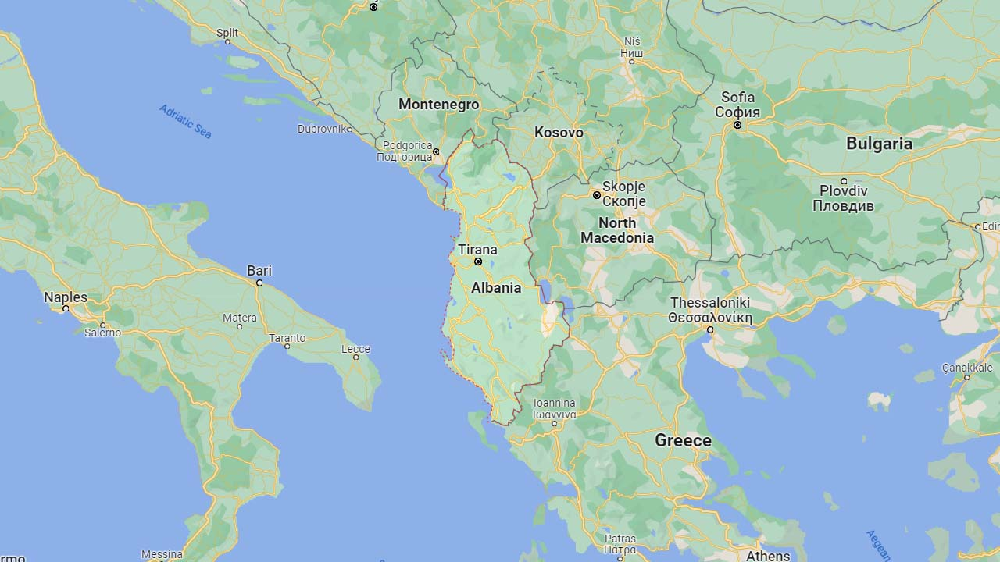
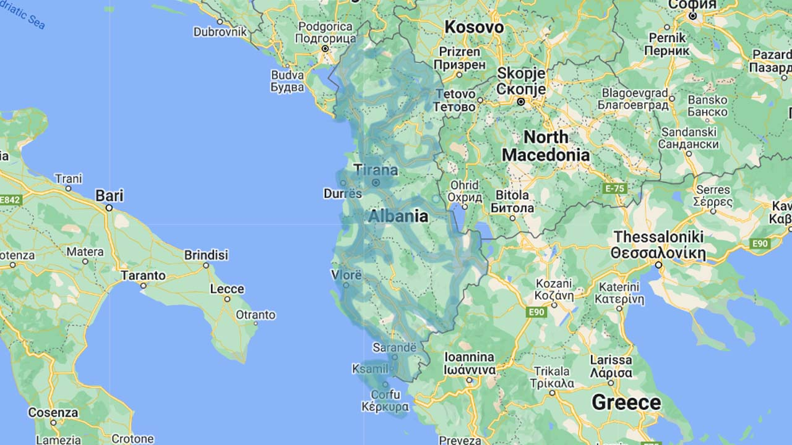

# Albania

EN | FR | Albanian | Contry top-level domain | Driving side
--- | --- | --- | --- | ---
Albania | Albanie | Shqipëria  | .al | Right

## Localisation

L'Albanie est un pays du Sud-Est de l'Europe, ses pays frontaliers sont le Monténégro, le Kosovo, la Macédoine du Nord et la Grèce.  

*[Google Maps](https://www.google.com/maps)*

## Drapeau

*[Wikipedia](https://en.wikipedia.org/wiki/Albania)*  

## Couverture

La couverture comprend les villes et les principaux axes routiers.  

*[Geoguessr](https://www.geoguessr.com/)*
