# Andorra

EN | FR | Catalan | Contry top-level domain | Driving side
--- | --- | --- | --- | ---
Andorra | Andorre | Andorra  | .ad | Right

## Localisation

Andorre est un petit étant situé entre la France et l'Espagne.  
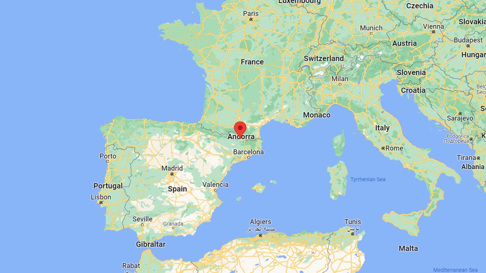
*[Google Maps](https://www.google.com/maps)*

## Drapeau

*[Wikipédia](https://en.wikipedia.org/wiki/Andorra)*

## Couverture

La couverture est centrée autour des principaux axes routiers.
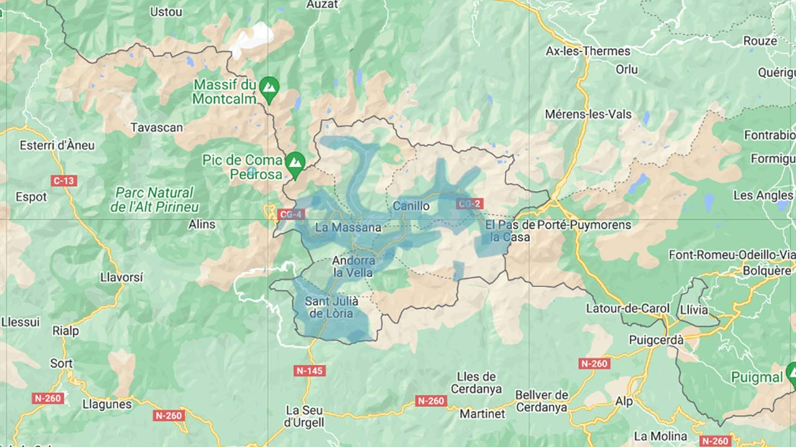
*[Geoguessr](https://www.geoguessr.com/)*

## Google car

Une petite antenne peut être visible.  
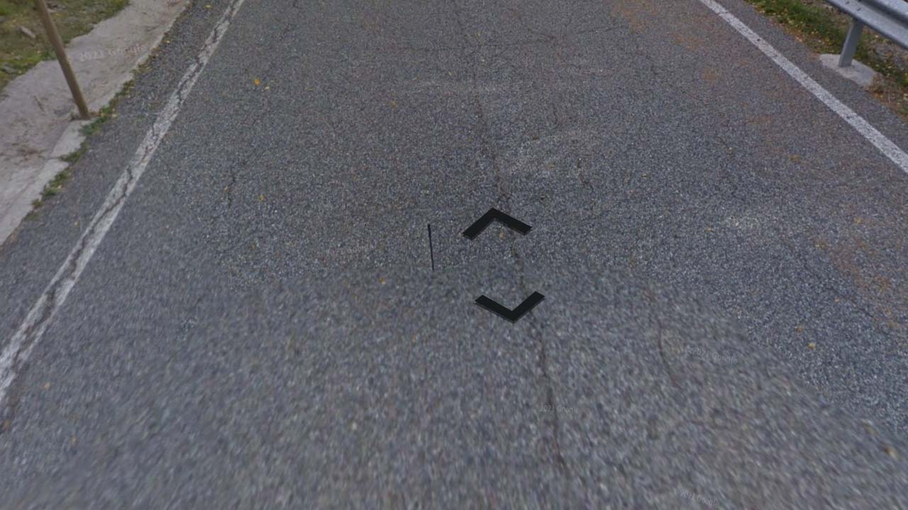
*[Google](https://earth.google.com/web)*

## Routes et signalisations

Le réseau comprend 6 routes principales (CG-, *carretera general*) et une trentaine de routes secondaires (CS-, *carretera secundària*). Les routes et les kilomètres sont indiqués par des petits panneaux. À cause du relief important, les petites routes sont très souvent construites en lacets. *[Wikipédia](https://ca.wikipedia.org/wiki/Llista_de_carreteres_d%27Andorra)*  
*[Wikipédia](https://ca.wikipedia.org/wiki/Llista_de_carreteres_d%27Andorra)*
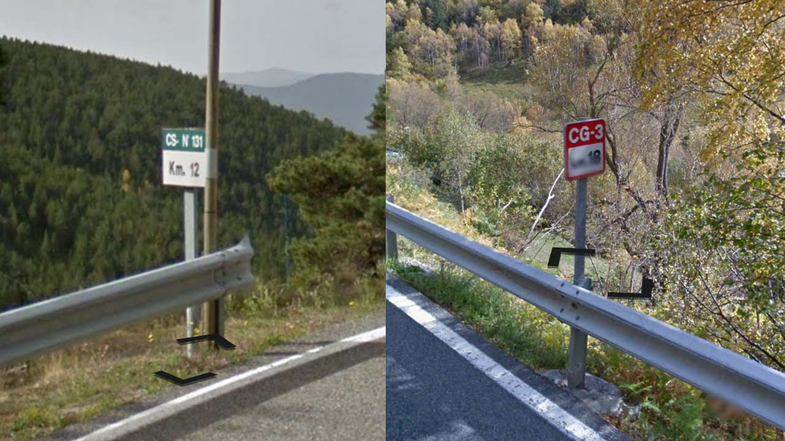
*[Google](https://earth.google.com/web)*

En ville, notamment dans la capitale, les routes sont souvent étroites et à sens uniques.  
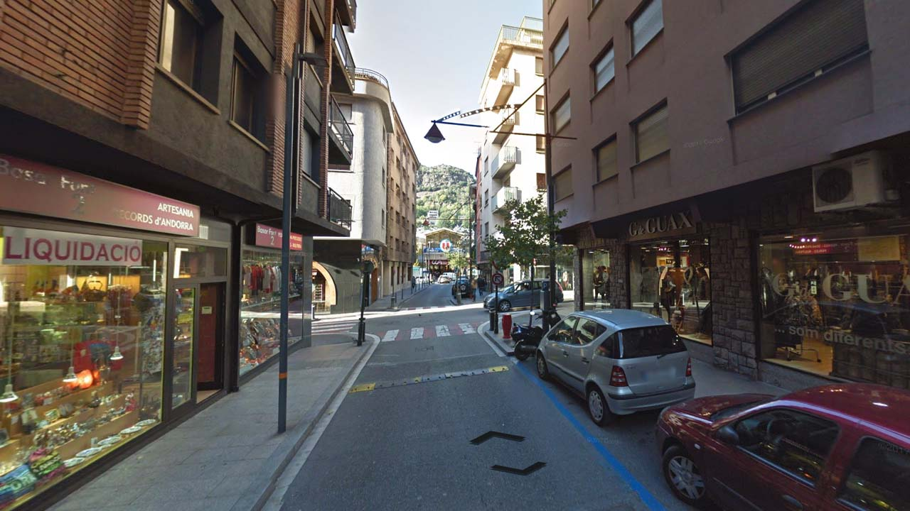
*[Google](https://earth.google.com/web)*

Ces marqueurs de neige colorés sont souvent visibles sur les bords des routes.  
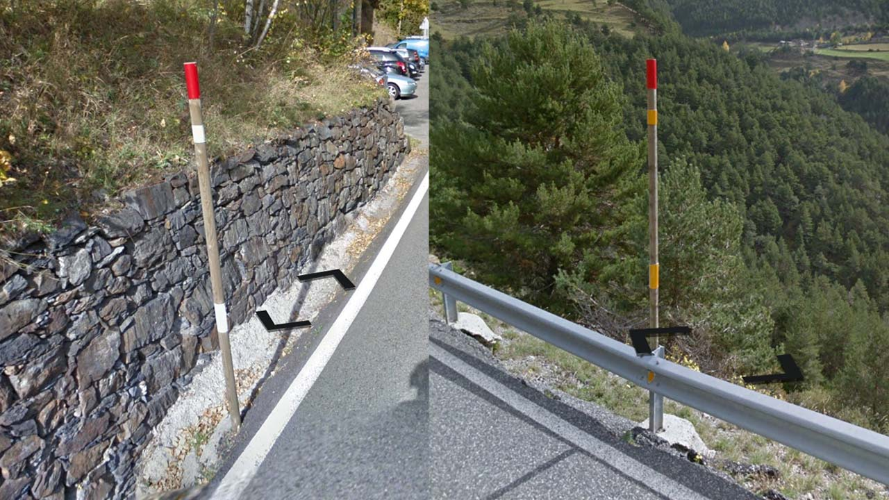
*[Google](https://earth.google.com/web)*

## Bâtiments

Les bâtiments sont souvent faits de briques, avec plusieurs étages et peuvent parfois être imposants.  
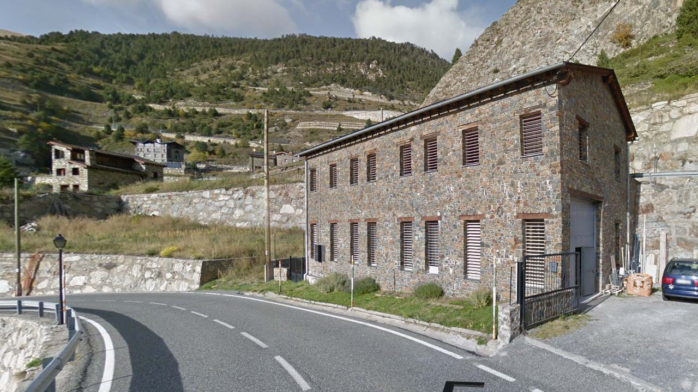
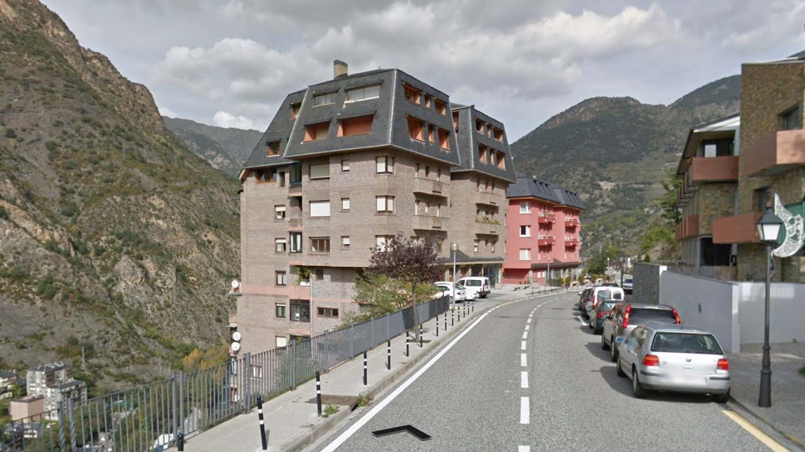
*[Google](https://earth.google.com/web)*

## Paysages

Le relief est important, forestier et rocheux.  
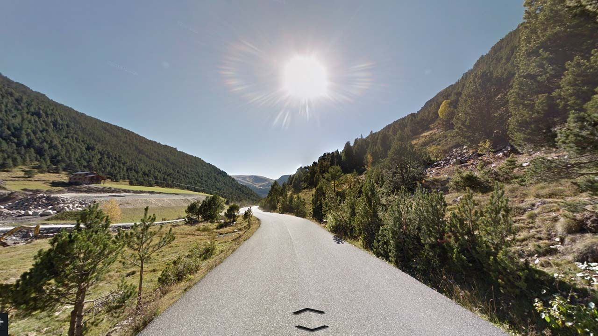
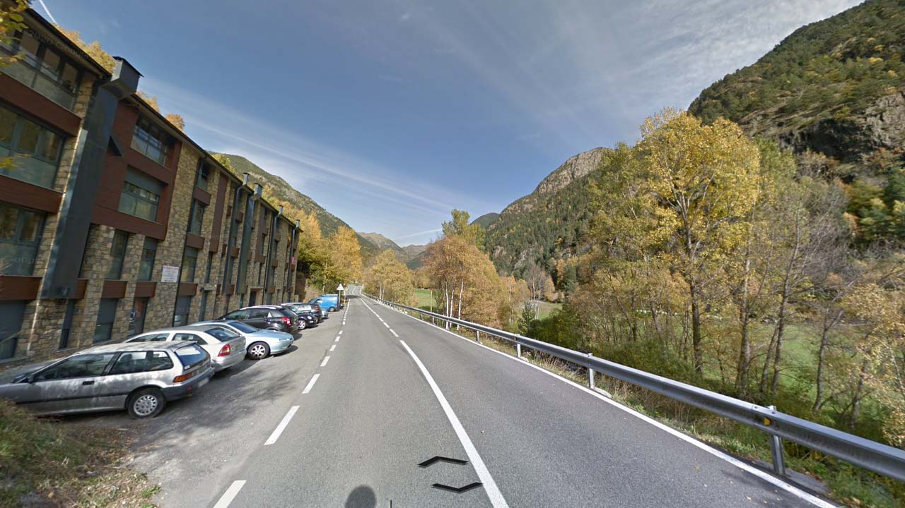
*[Google](https://earth.google.com/web)*

Des stations de ski sont couvertes au Nord-Est du pays, entre Canillo et El Pas de la Casa.  
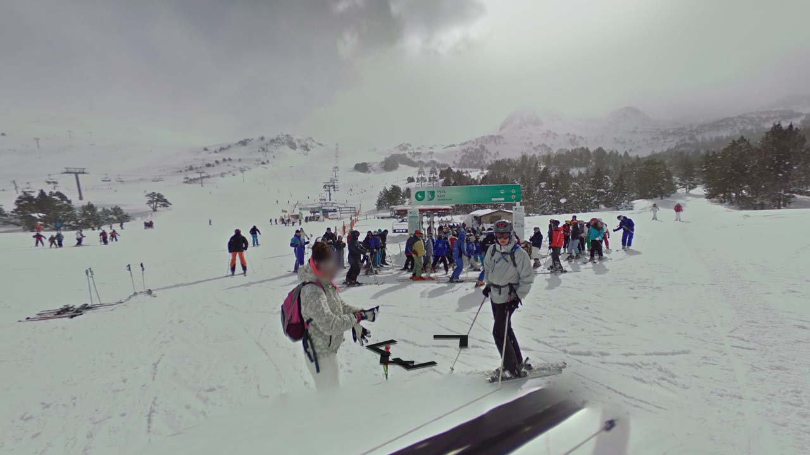
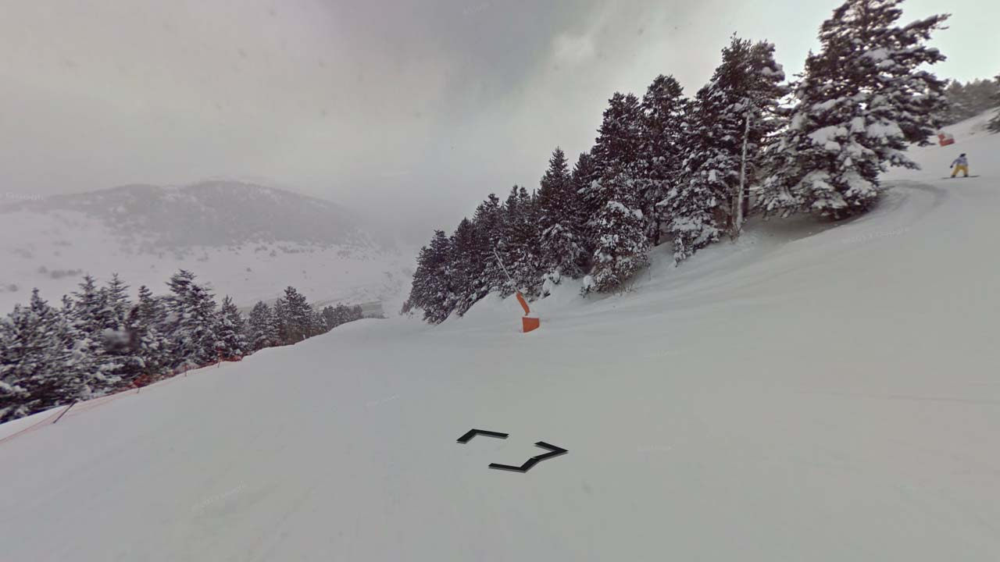
*[Google](https://earth.google.com/web)*
