# Argentina

EN | FR | Spanish | Contry top-level domain | Driving side
--- | --- | --- | --- | ---
Argentina | Argentine | Argentina  | .ar | Right

## Localisation

L'Argentine est située au Sud de l'Amérique du Sud, à l'Est du Chili.  
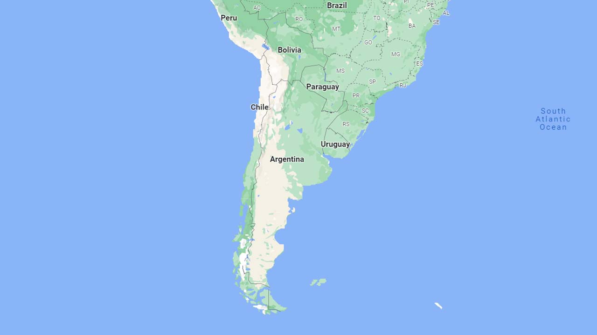
*source: [Google Maps](https://www.google.com/maps)*

## Drapeau

*source: [Wikipédia](https://en.wikipedia.org/wiki/Argentina)*

## Couverture

La couverture est relativement complète.  
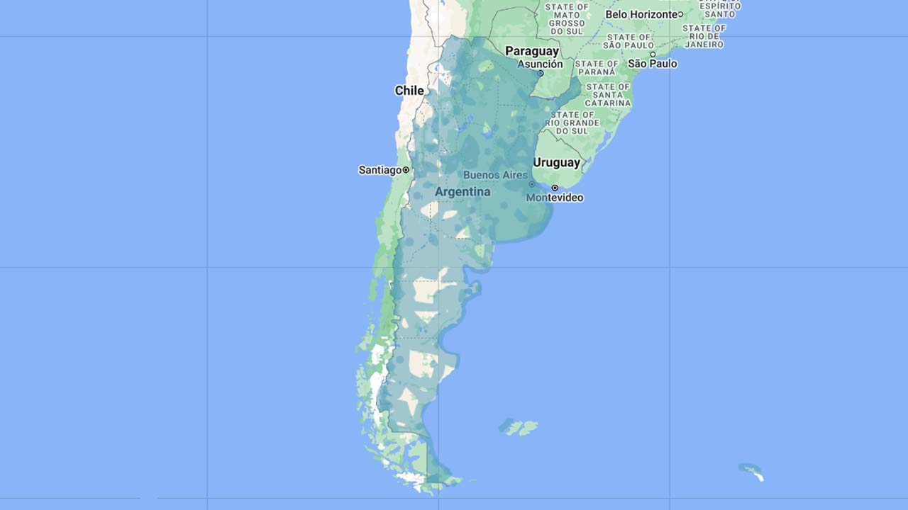
*source: [Geoguessr](https://www.geoguessr.com/)*

## Google car

Un capot noir est souvent visible. L'arrière de la voiture peut aussi apparaître.  
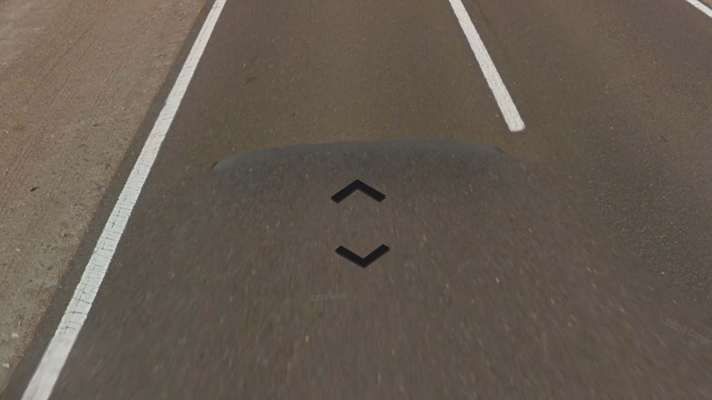
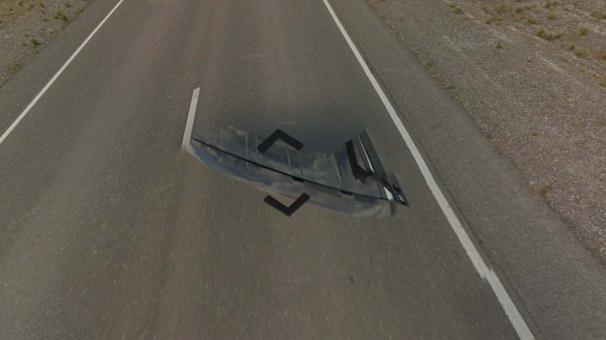
*source: [Google](https://earth.google.com/web)*

Certaines routes couvertes par cette voiture.  
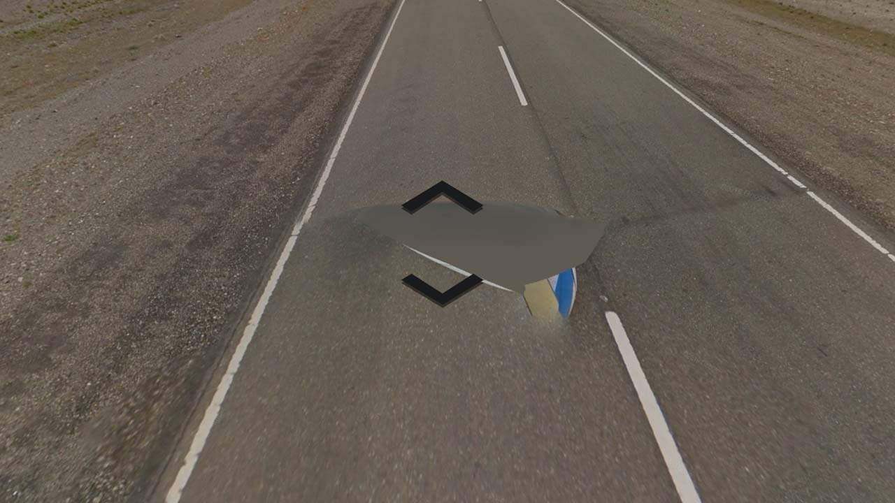
*source: [Google](https://earth.google.com/web)*

## Plaques d'immatriculations

Les [plaques argentines](https://en.wikipedia.org/wiki/Vehicle_registration_plates_of_Argentina) ont changé en 2016, les plus récentes sont blanches avec un bandeau bleu en haut de la plaque.  
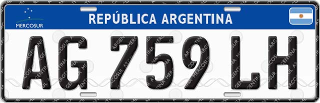
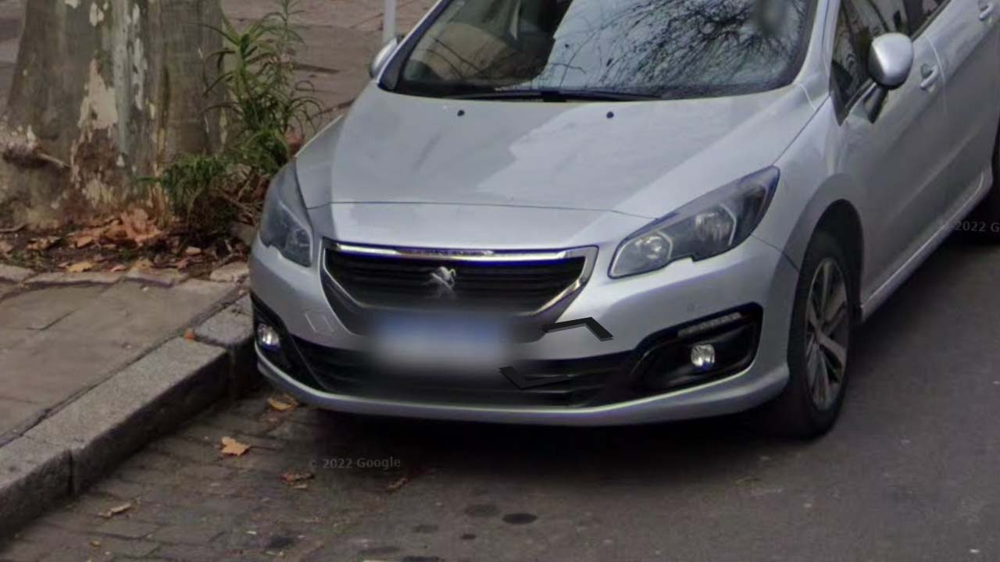
*source: [Google](https://earth.google.com/web)*

Les plaques d'avant 2016 sont noires avec un contour blanc. Avec le flou, on distingue des plaques blanches avec un point noir au milieu.  
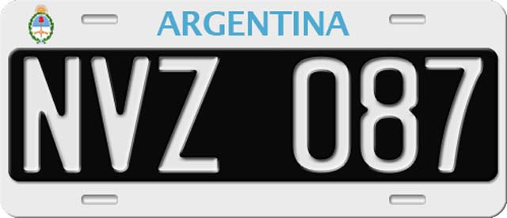
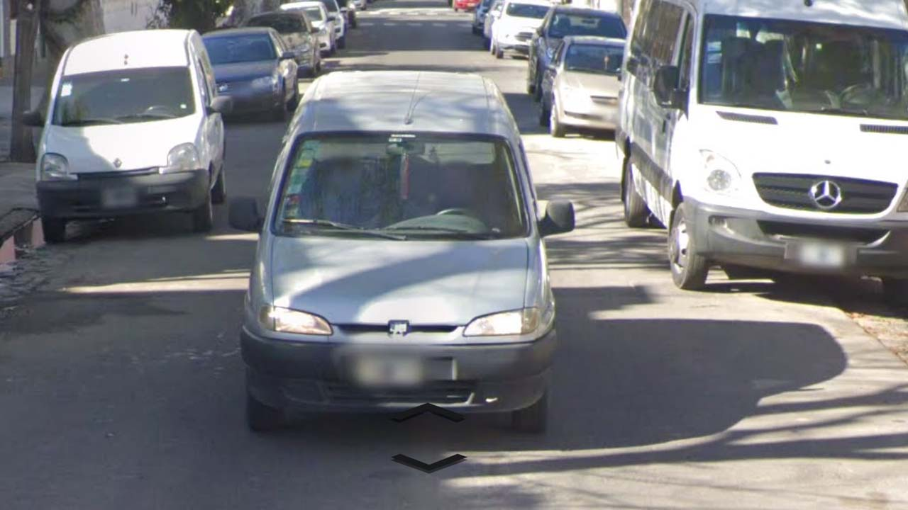
*source: [Google](https://earth.google.com/web)*

## Routes

Les routes sont souvent simples avec des lignes blanches sur les côtés et de pointillées au centre, mais il existe aussi des routes avec une double ligne jaune au centre.
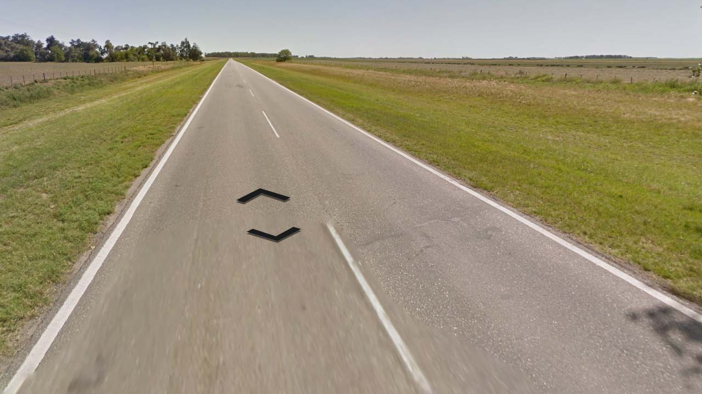
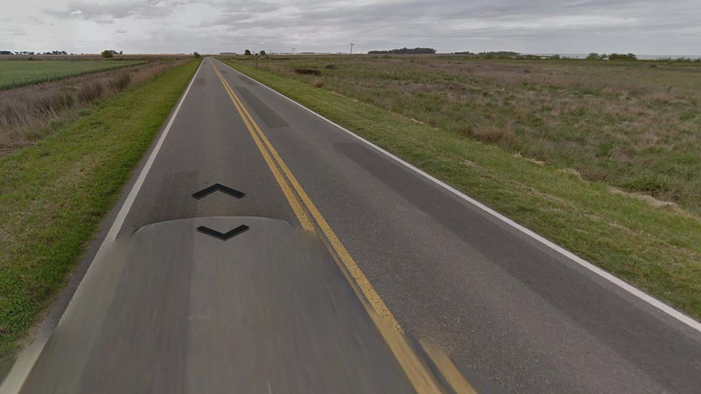
*source: [Google](https://earth.google.com/web)*

## Signalisation

Ces panneaux sont très fréquents dans les intersections, les couleurs peuvent varier en fonction de la ville et des quartiers.
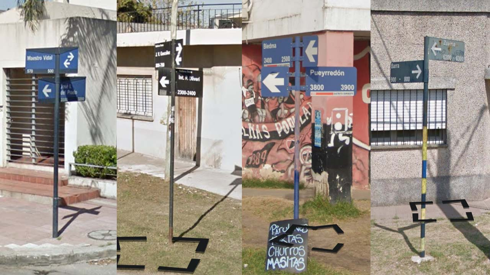
*source: [Google](https://earth.google.com/web)*

