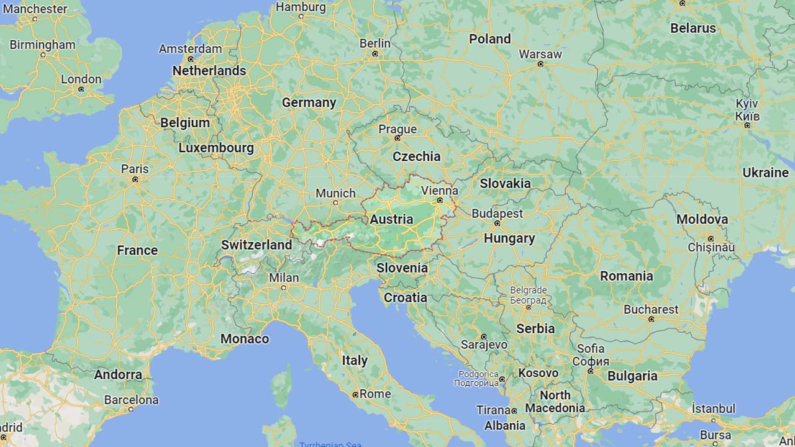
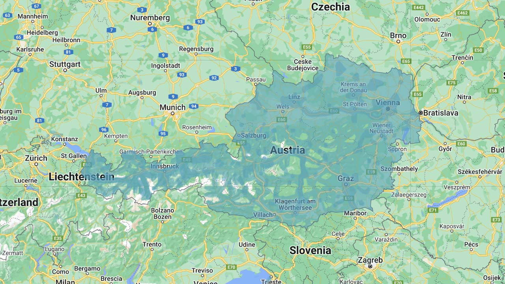
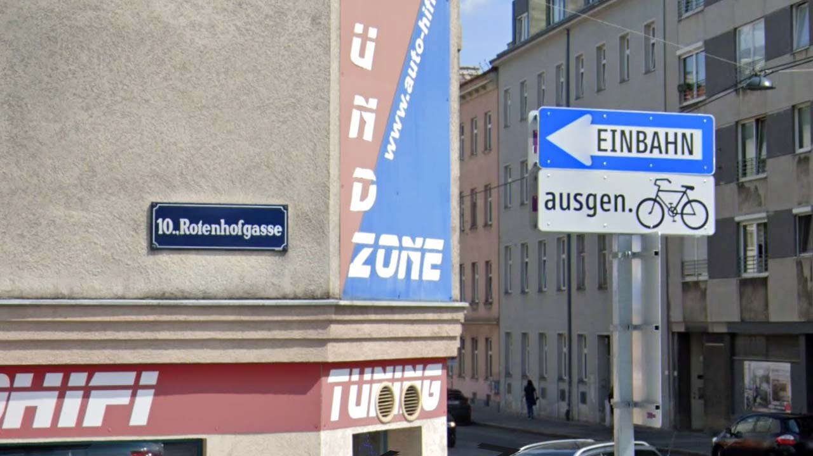
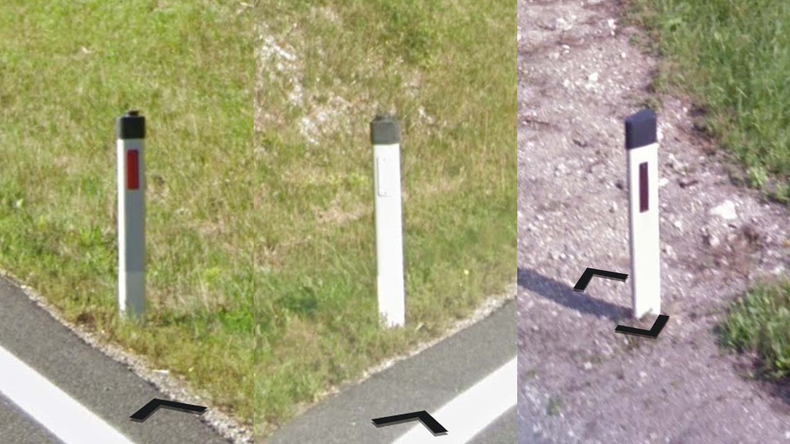

# Austria

EN | FR | German | Contry top-level domain | Driving side
--- | --- | --- | --- | ---
Austria | Autriche | Österreich  | .at | Right

## Localisation

L'Autriche est un pays au Sud de l'Europe centrale, situé entre la Suisse, le Liechtenstein, l'Allemagne, la Tchéquie, la Slovaquie, la Hongrie, la Slovénie et l'Italie.  

*[Google Maps](https://www.google.com/maps)*

## Drapeau

*[Wikipedia](https://en.wikipedia.org/wiki/Austria)*

## Couverture
 
La couverture est très complète.  

*[Geoguessr](https://www.geoguessr.com/)*

## Routes et signalisation

La police d'écrite des numéros de rue est très reconnaissable, les panneaux bleu et blanc avec écrit le mot "**Einbahn**" sont très fréquents, ils indiquent une voie à sens unique.  

*[Google](https://earth.google.com/web)*

Les délimiteurs sont de cette forme, seules les bornes où la bande réfléchissante à l'avant est de couleur foncée (et non rouge vif) sont uniques à l'Autriche. *[Geoguessr en français](https://www.youtube.com/watch?v=hlHIhLoAaXY)*  

*[Google](https://earth.google.com/web)
