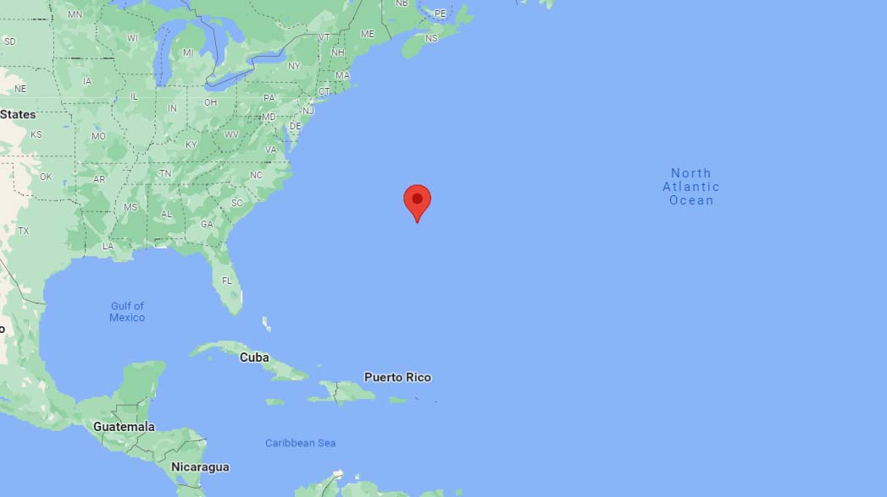
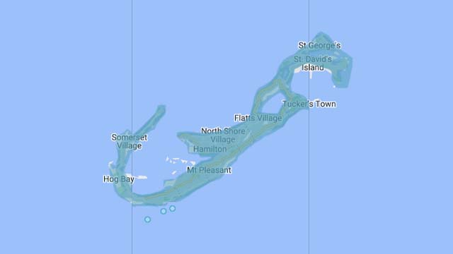
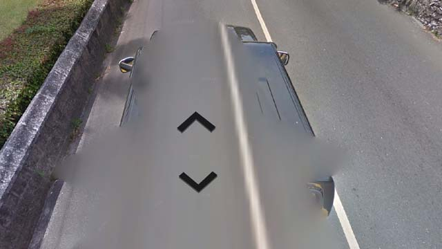
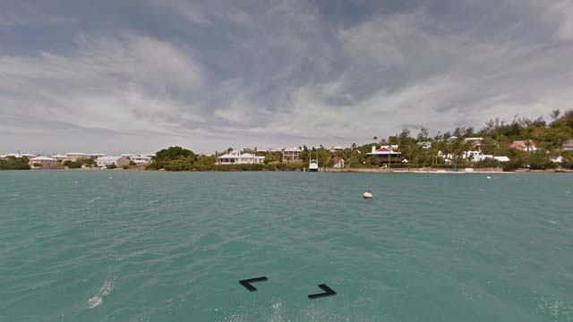

# Bermuda

EN | FR | English | Contry top-level domain | Driving side
--- | --- | --- | --- | ---
Bermuda | Bermudes | Bermuda | .bm | Left

## Localisation

Les Bermudes sont situés dans l'Atlantique Nord, à l'Est des États-Unis. L'archipel est un territoire britannique d'outre mer.  

*source: [Google](https://www.google.com/maps)*

## Drapeau

*source: [Wikipédia](https://en.wikipedia.org/wiki/Bermuda)*

## Couverture

L'île est entièrement couverte.  

*source: [Google](https://earth.google.com/web)*

## Couverture

Toujours le même pickup noir avec carrosserie très souvent visible.  

*source: [Google](https://earth.google.com/web)*

Une partie au Nord de l'île est couverte en bateau.  

*source: [Google](https://earth.google.com/web)*
