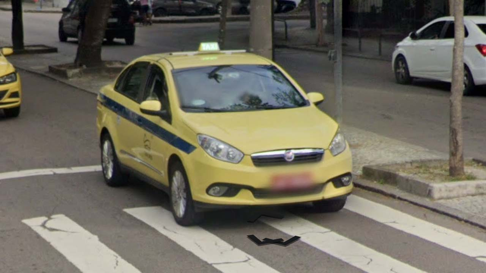

# Brazil

EN | FR | Portuguese | Contry top-level domain | Driving side
--- | --- | --- | --- | ---
Brazil | Brésil | Brasil  | .br | Right

## Localisation

Le Brésil est un pays très vaste situé à l'Est de l'Amérique latine.  

*source: [Google Maps](https://www.google.com/maps)*

## Drapeau

*source: [Wikipedia](https://en.wikipedia.org/wiki/Brazil)*

## Couverture

La couverture est moindre à l'Ouest du pays mais est relativement importante à l'Est.

*source: [Geoguessr](https://www.geoguessr.com/)*

## Google car

Un capot bleu ou blanc peut apparaitre. Quand la voiture est blanche, on peut rarement distinguer une petite antenne.  

*source: [Google](https://earth.google.com/web)*

## Plaques d'immatriculations

Les plaques brésiliennes ont changé en 2018 pour les plaques standard du Mercosur, les véhicules privés ont une plaque blanche avec écritures noires et un bandeau bleu sur la partie haute. Seul la couleur de l'écriture change pour les véhicules spéciaux, les taxis ont une écriture rouge. *source: [Wikipedia](https://en.wikipedia.org/wiki/Vehicle_registration_plates_of_Brazil)*  

*source: [Google](https://earth.google.com/web)*

Les anciennes plaques privées étaient grises avec une écriture noire, tandis que les plaques de taxis étaient rouges avec écritures blanches.  

*source: [Google](https://earth.google.com/web)*

Les anciennes plaques sont 
