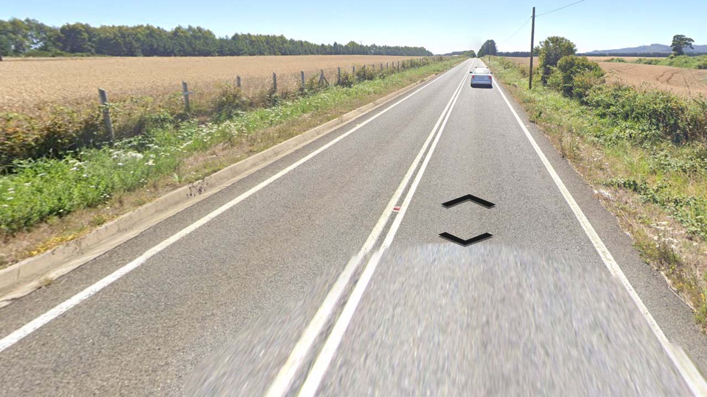

# Chile

EN | FR | Spanish | Contry top-level domain | Driving side
--- | --- | --- | --- | ---
Chile | Chili | Chile  | .cl | Right

## Localisation

Le Chili est situé en Amérique du Sud, à l'Ouest de l'Argentine et de la Bolivie.  

*source: [Google Maps](https://www.google.com/maps)*

## Drapeau

*source: [Wikipedia](https://en.wikipedia.org/wiki/Chile)*

## Couverture

Le pays est relativement couvert, hormis l'extrème Sud du pays.

*source: [Geoguessr](https://www.geoguessr.com/)*

## Google car

Un capot blanc est souvent visible. L'arrière de la voiture peut aussi apparaître.  

*source: [Google](https://earth.google.com/web)*

## Plaques d'immatriculations

Les plaques chiliennes sont blanches avec écritures noires. *source: [Wikipedia](https://es.wikipedia.org/wiki/Matr%C3%ADculas_automovil%C3%ADsticas_de_Chile)*   

*source: [Wikipedia](https://en.wikipedia.org/wiki/Argentina)*

*source: [Google](https://earth.google.com/web)*

## Routes et signalisation

Les routes sont blanches, les lignes centrales peuvent être continues ou en pointillés.  

*source: [Google](https://earth.google.com/web)*

À l'extrême Sud du pays, dans la terre de feu, les lignes peuvent être entièrement ou partiellement jaunes.  

*source: [Google](https://earth.google.com/web)*

Il existe aussi une multitude de routes non goudronnées.  

*source: [Google](https://earth.google.com/web)*

Ces panneaux sont visibles dans les intersections.

*source: [Google](https://earth.google.com/web)*
