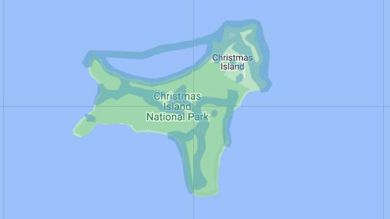
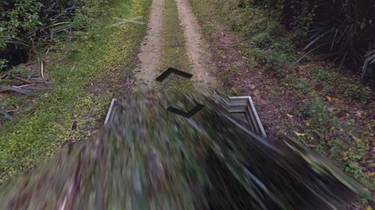
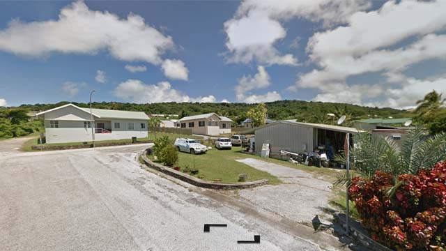
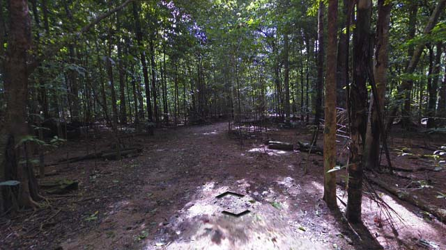

# Christmas Island (Australia)

EN | FR | English | Contry top-level domain | Driving side
--- | --- | --- | --- | ---
Christmas Island | Île Christmas | Christmas Island | .cx | Left

## Google car

L'île est relativement petite et la couverture est centrée au Nord-Est.

*source: [Google](https://earth.google.com/web)*

L'arrière de la voiture est toujours visible et très reconnaissable.  

*source: [Google](https://earth.google.com/web)*

## Paysages

### Villes

Seul la petite partie Nord-Est qui comprend le port est pourvu d'habitations.  

*source: [Google](https://earth.google.com/web)*

### Campagnes

Le reste de l'île est très forestier, notamment au centre.  

*source: [Google](https://earth.google.com/web)*
