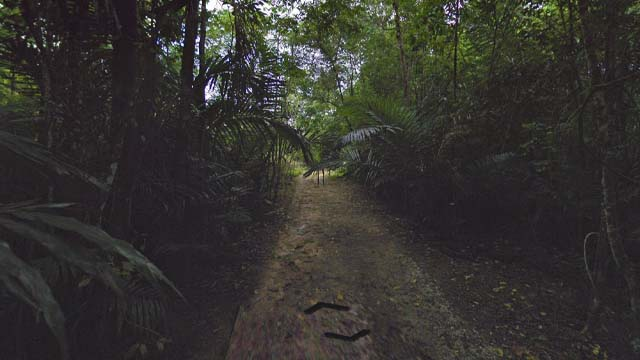

# Christmas Island (Australia)

EN | FR | English | Contry top-level domain | Driving side
--- | --- | --- | --- | ---
Christmas Island | Île Christmas | Christmas Island | .cx | Left

## Localisation

L'île Christmas est située à l'Ouest de l'Indonésie. L'île est un territoire extérieur australien.  

*source: [Google Maps](https://www.google.com/maps)*

## Drapeau

*source: [Wikipédia](https://en.wikipedia.org/wiki/Christmas_Island)*

## Couverture

L'île est relativement petite et la couverture est centrée au Nord-Est. Une partie en bateau est présente au Nord de l'île et certaines plages ont étés couvertes à pied.  

*source: [Geoguessr](https://www.geoguessr.com/)*

## Google car

L'arrière de la voiture est toujours visible et très reconnaissable.  

*source: [Google](https://earth.google.com/web)*

## Paysages

### Villes

Seul la petite partie Nord-Est qui comprend le port est pourvu d'habitations.  

*source: [Google](https://earth.google.com/web)*

### Campagnes

Le reste de l'île est très forestier, notamment au centre.  

*source: [Google](https://earth.google.com/web)*

L'île est connue pour sa période de migration de crabes rouges (octobre-novembre). Ils apparaissent dans certaines zones.  

*source: [Google](https://earth.google.com/web)*
