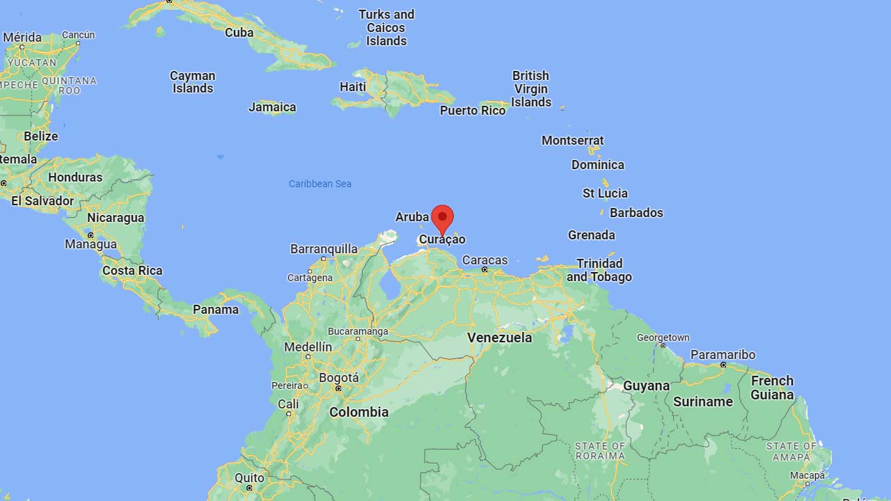

# Curaçao (Netherlands)

EN | FR | Papiamento | Contry top-level domain | Driving side
--- | --- | --- | --- | ---
Curaçao | Curaçao | Kòrsou | .cw | Right

## Localisation

Curaçao est située au Nord du Venezuela. L'île est un état autonome au sein du royaume des Pays-Bas.  

*source: [Google Maps](https://www.google.com/maps)*

## Drapeau

*source: [Wikipédia](https://fr.wikipedia.org/wiki/Cura%C3%A7ao)*

## Couverture

L'île est entièrement couverte.  

*source: [Geoguessr](https://www.geoguessr.com/)*

## Google car

Capot noir avec deux barres de toit avec des autocollants blancs visibles en même temps.  

*source: [Google](https://earth.google.com/web)*

## Paysages

### Villes

Les poteaux électriques sont très souvent noirs avec le bas peint en blanc.  

*source: [Google](https://earth.google.com/web)*
