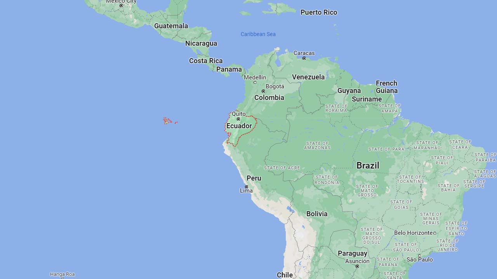
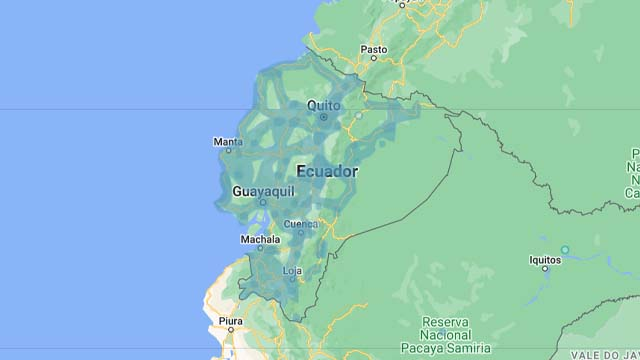

# Ecuador

EN | FR | Spanish | Contry top-level domain | Driving side
--- | --- | --- | --- | ---
Ecuador | Équateur | Ecuador | .ec | Right

## Localisation

L'Équateur est situé en Amérique du sud, au nord du Pérou et à l'ouest de la Colombie.  

*source: [Google Maps](https://www.google.com/maps)*

## Drapeau

*source: [Wikipédia](https://en.wikipedia.org/wiki/Ecuador)*

## Couverture

La couverture est moins prononcée à l'Est du pays.  

*source: [Geoguessr](https://www.geoguessr.com/)*

## Google car

Une antenne peut être visible.

*source: [Google](https://earth.google.com/web)*
