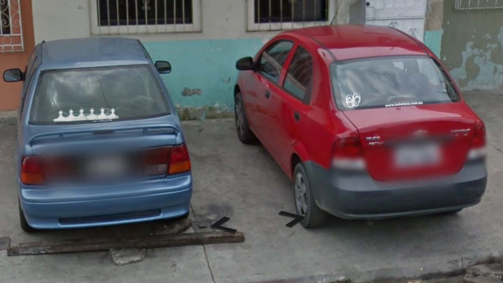
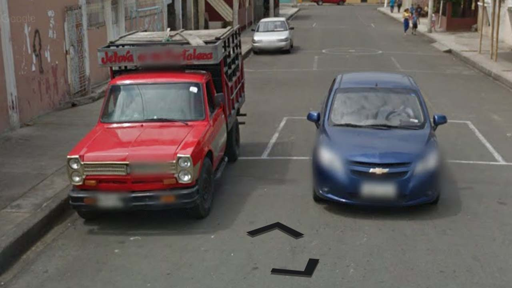
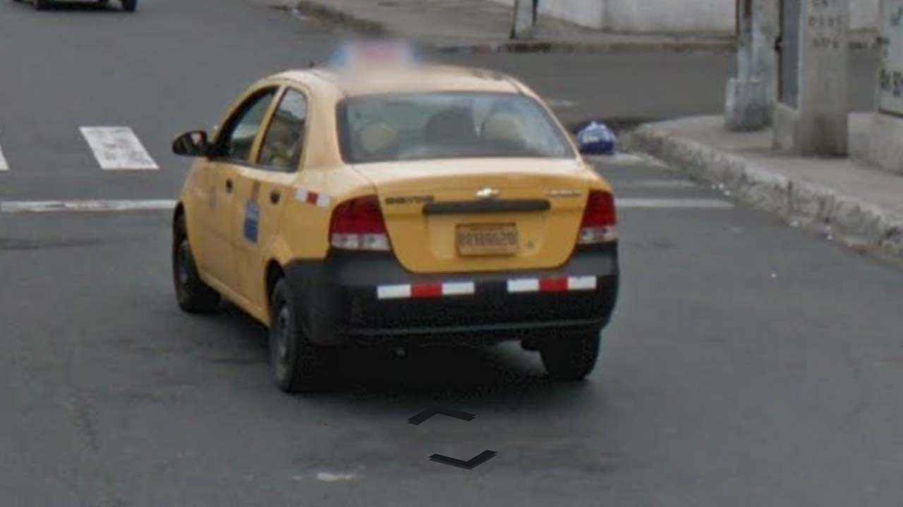

# Ecuador

EN | FR | Spanish | Contry top-level domain | Driving side
--- | --- | --- | --- | ---
Ecuador | Équateur | Ecuador | .ec | Right

## Localisation

L'Équateur est situé en Amérique du sud, au nord du Pérou et à l'ouest de la Colombie.  

*source: [Google Maps](https://www.google.com/maps)*

## Drapeau

*source: [Wikipédia](https://en.wikipedia.org/wiki/Ecuador)*

## Couverture

La couverture est moins prononcée à l'Est du pays.  

*source: [Geoguessr](https://www.geoguessr.com/)*

## Google car

Une antenne peut être visible.  

*source: [Google](https://earth.google.com/web)*

## Plaques d'immatriculation

Les [plaques équatoriennes](https://en.wikipedia.org/wiki/Vehicle_registration_plates_of_Ecuador) sont en cours de remplacement (depuis 2012), la forme peut donc être différente en fonction des voitures. Les plaques privées sont blanches avec une écriture noire.  

*source: [Google](https://earth.google.com/web)*

Les véhicules commerciaux (taxi ou bus) et les véhicules officiels ont une plaque de couleurs différentes. Pour les plaques récentes, la plaque reste blanche mais la couleur apparaît dans un bandeau.    

*source: [Google](https://earth.google.com/web)*
