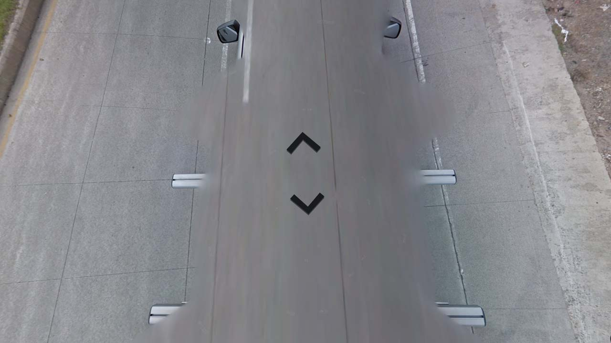

# Guatemala

EN | FR | Spanish | Contry top-level domain | Driving side
--- | --- | --- | --- | ---
Guatemala | Guatemala | Guatemala  | .gt | Right

## Localisation

Le Guatemala est situé en Amérique centrale, entre le Mexique, Belize, le Honduras et le Salvador.  

*[Google Maps](https://www.google.com/maps)*

## Drapeau

*[Wikipedia](https://en.wikipedia.org/wiki/Guatemala)*

## Google car

Des barres de toit et des rétroviseurs sont toujours visibles.  

*[Google](https://earth.google.com/web)*
