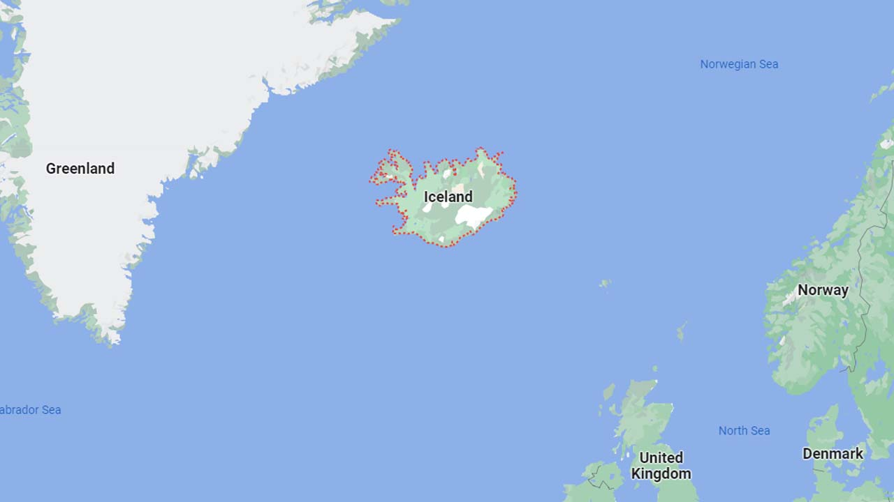
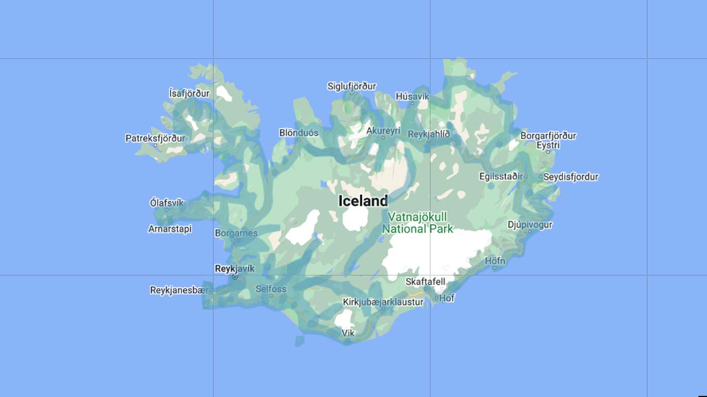
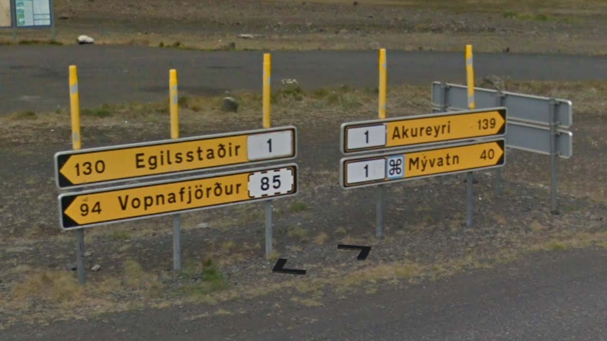

# Iceland

EN | FR | Icelandic | Contry top-level domain | Driving side
--- | --- | --- | --- | ---
Iceland | Islande | Ísland  | .is | Right

## Localisation

L'Islande est située dans l'Océan Atlantique, entre le Groenland et la Norvège, au Nord-Ouest des îles Féroé.  

*[Google Maps](https://www.google.com/maps)*

## Drapeau

*[Wikipedia](https://en.wikipedia.org/wiki/Iceland)*

## Couverture

La couverture est présente uniquement sur les bords de l'île.  

*[Geoguessr](https://www.geoguessr.com/)*

## Google car

Une longue antenne est toujours visible.  

*[Google](https://earth.google.com/web)*

## Routes et signalisation

La route n°1 est la route principale, elle fait un tour complet de l'île. Les numéros des routes secondaires commencent par un 2 au Sud-Ouest, puis augmentent dans le sens des aiguilles d'une montre pour arriver à 9, au Sud-Est de l'île.  

*[Wikipedia](https://en.wikipedia.org/wiki/List_of_roads_in_Iceland)*

Les panneaux désignant les routes sont jaunes.  

*[Google](https://earth.google.com/web)*
