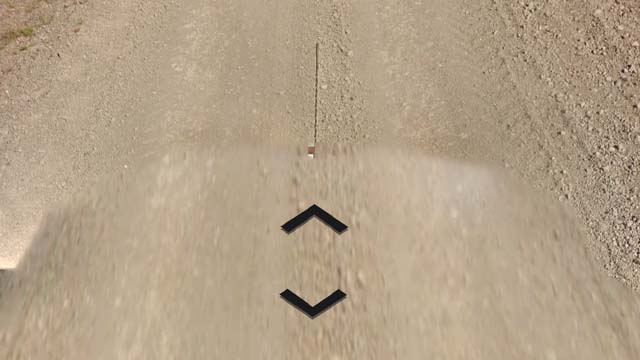
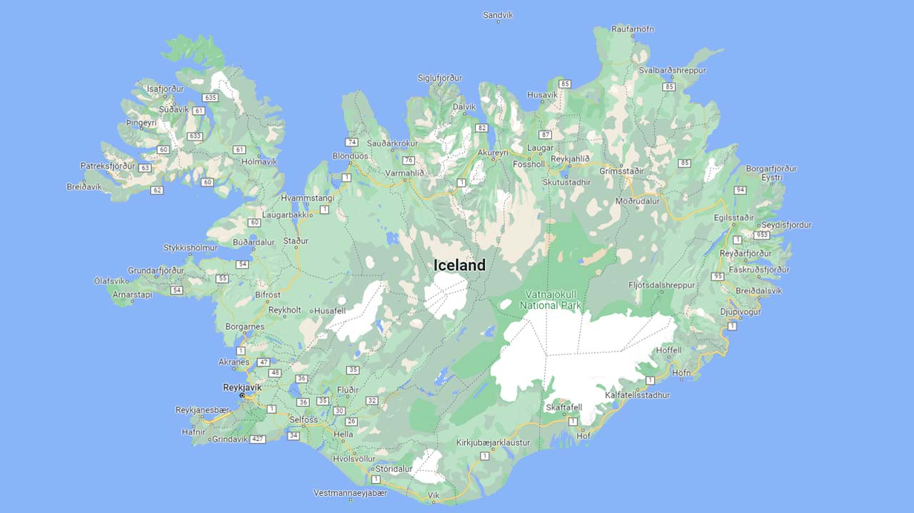

# Iceland

## Google car

Always an long antenna.  

*source: [Google](https://earth.google.com/web)*

## Roads

National Highway System :

Eight numbering zones divide the island. Each dialing zone has a number which determines which is the first digit of the number. 1 is reserved for the ring road and the others increase clockwise from southeast to east.  

*source: [Wikipedia](https://en.wikipedia.org/wiki/List_of_roads_in_Iceland)*
