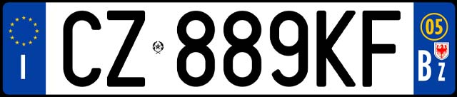
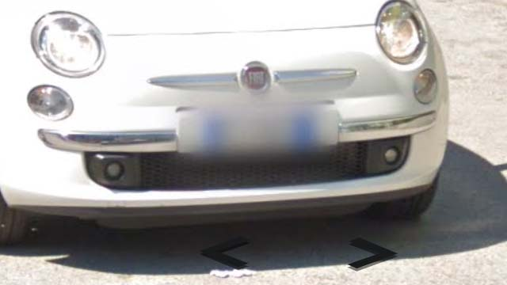
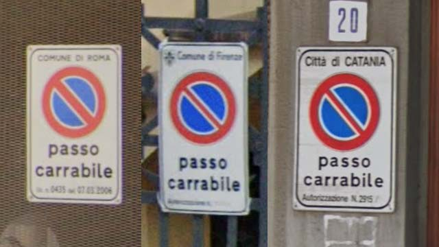

# Italy

EN | FR | Italian | Contry top-level domain | Driving side
--- | --- | --- | --- | ---
Italy | Italie | Italia | .it | Right

## Plaques d'immatriculations

Présence d'une bande bleue de chaque côté, visible à travers le flou. La marque FIAT est très commune.  

*source: [Google](https://earth.google.com/web)*

## Numéros de téléphone

Le premier chiffre augmente du Nord vers le Sud.   

*source: [Wikipedia](https://en.wikipedia.org/wiki/Telephone_numbers_in_Italy)*

## Paysages

### Villes

Les panneaux "passo carrabile" (zone de remorquage) sont très fréquent, le nom de la ville est écrit en haut du panneau. Dans l'exemple : Rome, Florence et Catane (Catania).  

*source: [Google](https://earth.google.com/web)*
