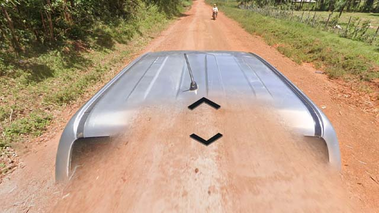

# Kenya

## Drapeau

*source: [Wikipedia](https://en.wikipedia.org/wiki/Kenya)*

## Google car

La couverture est plutôt centrée au Sud-Ouest du pays.  

*source: [Geoguessr](https://www.geoguessr.com/)*

La plupart du temps et sur les axes principaux, un pick-up gris visible, il peut avoir une ou deux antennes et/ou un snorkel.  

*source: [Google](https://earth.google.com/web)*

Ils existe plusieurs autre pick-up avec des éléments visibles ou non, ils apparaissent souvent dans le parcs nationaux.  

*source: [Google](https://earth.google.com/web)*
