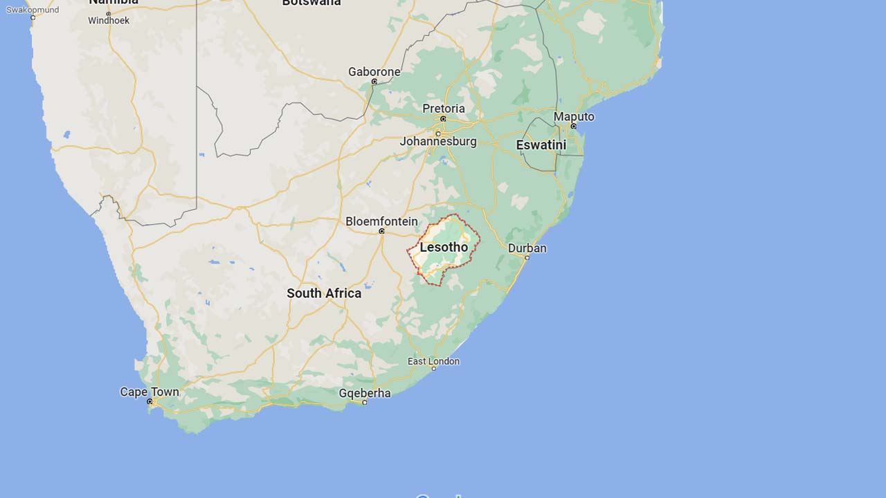
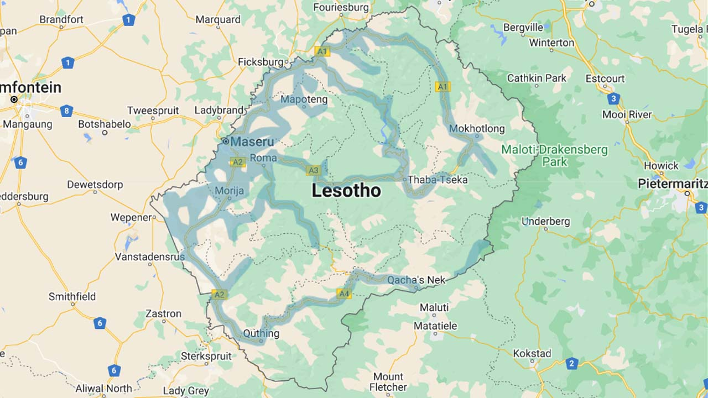
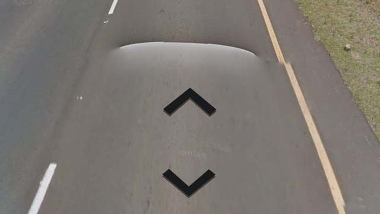

# Lesotho

EN | FR | Sotho | Contry top-level domain | Driving side
--- | --- | --- | --- | ---
Lesotho | Lesotho | Lesotho | .ls | Left

## Localisation

Le Lesotho est un petit pays d'Afrique australe entièrement enclavé dans l'Afrique du Sud.

*source: [Google Maps](https://www.google.com/maps)*

## Drapeau

*source: [Wikipédia](https://en.wikipedia.org/wiki/Lesotho)*

## Couverture

La couverture est importante sur la partie Ouest du pays, et notamment autour de la capite Maseru.  

*source: [Geoguessr](https://www.geoguessr.com/)*

## Google car

Un arrière blanc est toujours visible.

*source: [Geoguessr](https://www.geoguessr.com/)*

## Google car

White car very often visible.  

*source: [Google](https://earth.google.com/web)*
