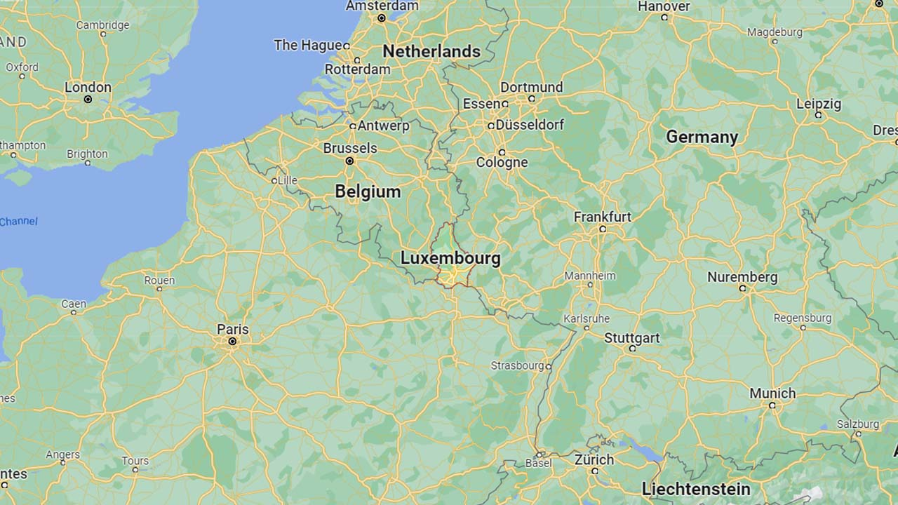
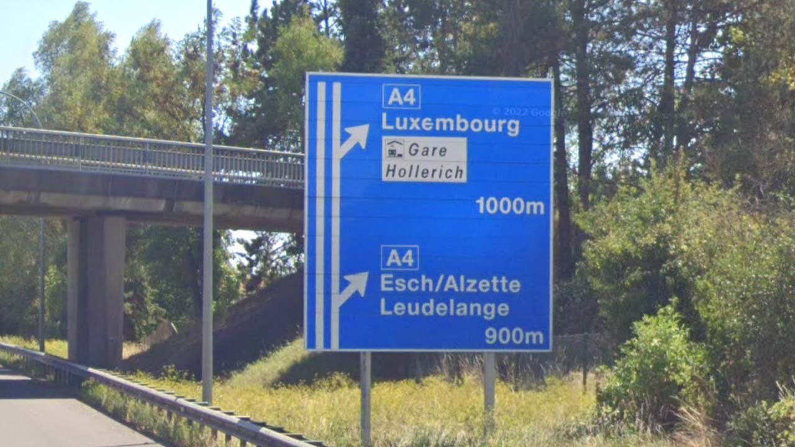
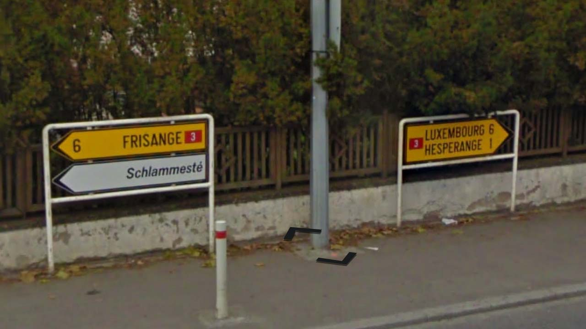
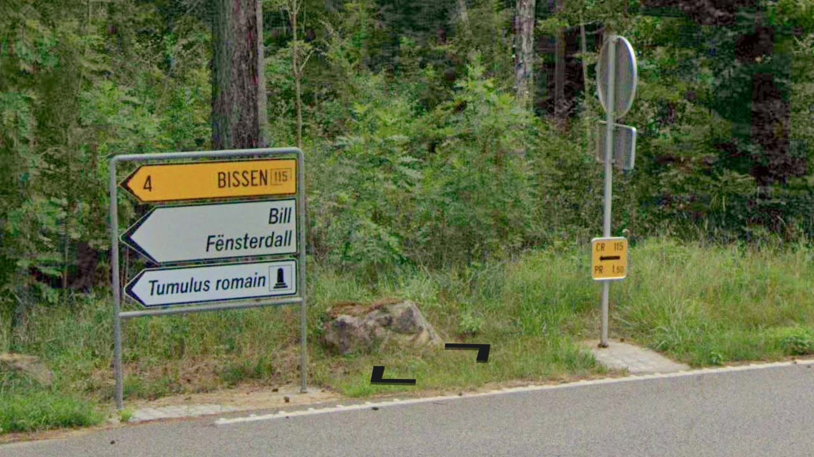
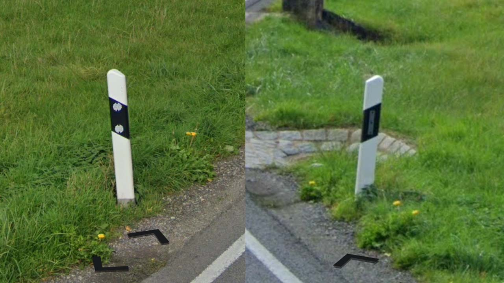
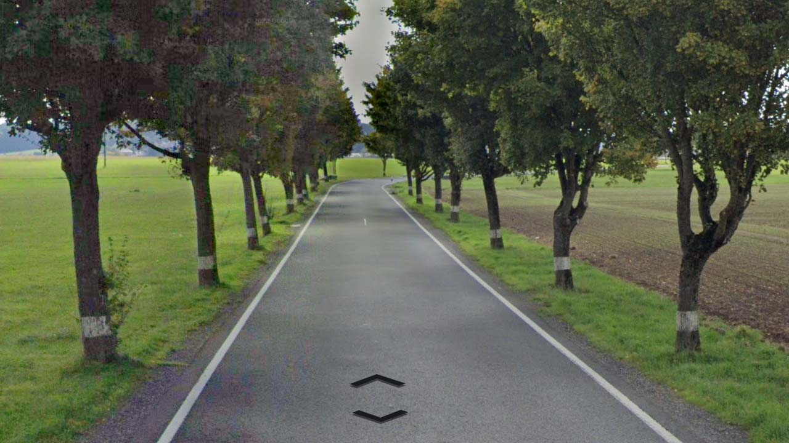

# Luxembourg

EN | FR | Luxembourgish | Contry top-level domain | Driving side
--- | --- | --- | --- | ---
Luxembourg | Luxembourg | Lëtzebuerg | .lu | Right

## Localisation

Le Luxembourg est un pays d'Europe de l'Ouest, il est situé entre la Belgique, la France et l'Allemagne.  

*source: [Google Maps](https://www.google.com/maps)*

## Drapeau

*source: [Wikipédia](https://en.wikipedia.org/wiki/Luxembourg)*

## Couverture

La couverture est complète.  

*source: [Geoguessr](https://www.geoguessr.com/)*

## Plaques d'immatriculations

Plaques européennes jaunes à l'avant et l'arrière.   

*source: [Google](https://earth.google.com/web)*

## Routes et signalisations

Les routes sont divisées en 4 catégories (en plus des routes européennes): les "autoroutes" (*motorways*) (A), les voies express (*expressways*) (B), les routes nationales (*national roads*) (N) et les routes locales (*local roads*) (CR). *source: [Road numbering systems](https://sites.google.com/site/roadnumberingsystems/home/countries/luxembourg)*  

Les autoroutes sont indiquées par des panneaux bleus.  

Les routes nationales et les voies express sont indiquées dans des encadrées rouges.  

Les routes locales sont dans des encadrées jaunes, dans la partie Nord du pays le chiffre des centaines est **3** alors qu'il est de **1** ou **2** pour les routes du Sud.  

Les délimitateurs sont très souvent visibles en dehors des villes.  

Lorsque les routes sont longées d'arbres, leurs troncs peuvent être peints en blanc pour faire office de délimitateurs.  

*source: [Google](https://earth.google.com/web)*
