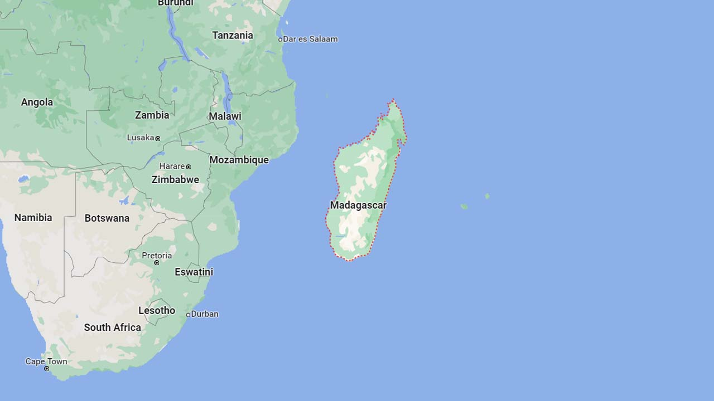
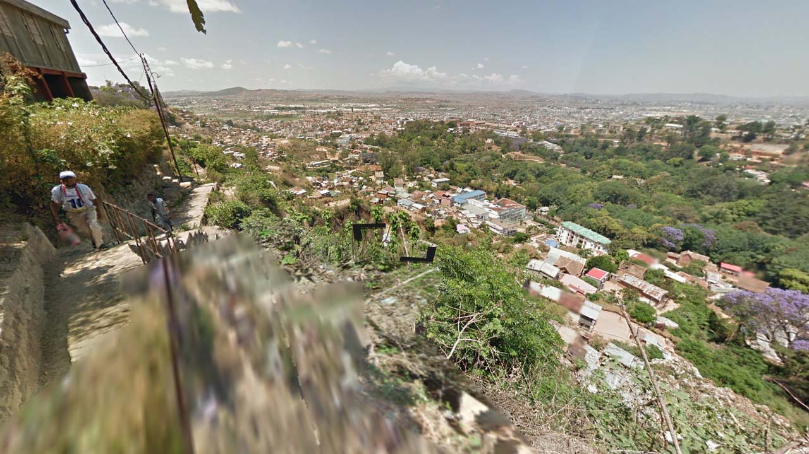

# Argentina

EN | FR | Malagasy | Contry top-level domain | Driving side
--- | --- | --- | --- | ---
Madagascar | Madagascar | Madagasikara  | .mg | Right

## Localisation

Madagascar est une grade île située à l'Est de l'Afrique du Sud, dans l'océan Indien.  

*[Google Maps](https://www.google.com/maps)*

## Drapeau

*[Wikipedia](https://en.wikipedia.org/wiki/Madagascar)*

## Couverture

La couverture est presque inexistante, seule quelques très court parcours sont couverts.  

*[Geoguessr](https://www.geoguessr.com/)*

Un court chemin étroit est couvert dans la capitale **Antananarivo**.  

*[Google](https://earth.google.com/web)*

*[Geoguessr](https://www.geoguessr.com/)*
