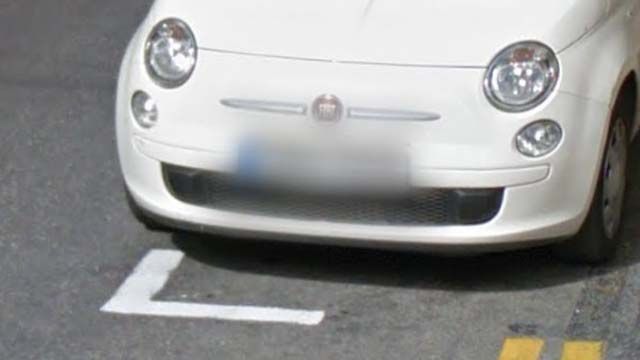
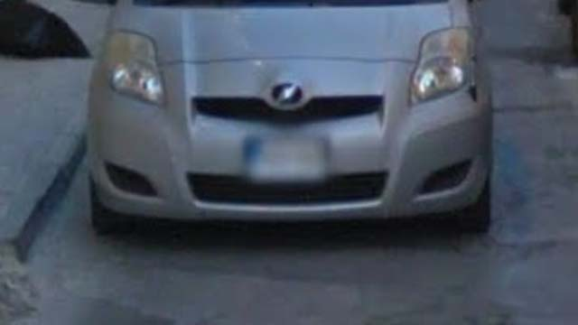
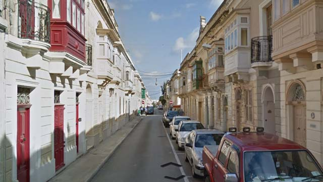
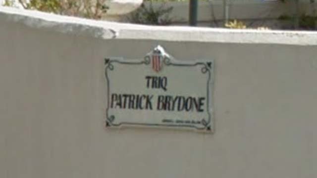
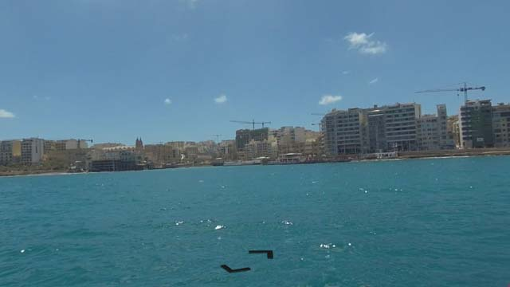
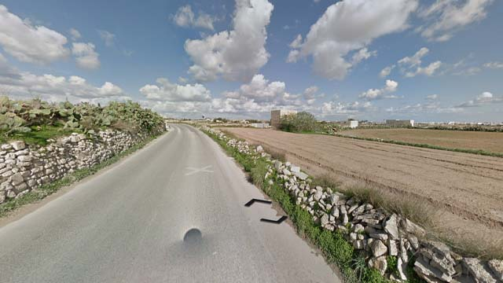
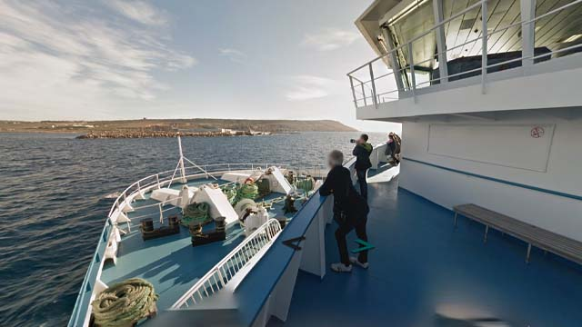

# Malta

EN | FR | Maltese | Contry top-level domain | Driving side
--- | --- | --- | --- | ---
Malta | Malte | Malta | .mt | Left

## Plaques d'immatriculations

Possibilité de croiser 2 types de plaques, les plaques européennes classiques, et une version plus courte avec une zone bleue dans la partie supérieure gauche.  

*source: [Google](https://earth.google.com/web)*

## Paysages

### Villes

Les rues sont étroites et les bâtiments ont tous une couleur crème.  

*source: [Google](https://earth.google.com/web)*

En maltais, "rue" s'écrit "triq". Chaque ville a un unique style de panneau de rue.  

*source: [Google](https://earth.google.com/web)*

Les côtes peuvent aussi être couvertes.  

*source: [Google](https://earth.google.com/web)*

### Campagnes

Le paysage est méditerranéen avec très souvent de petits murets en pierre.  

*source: [Google](https://earth.google.com/web)*

Certains passages en bateau sont aussi photographiées.

*source: [Google](https://earth.google.com/web)*
