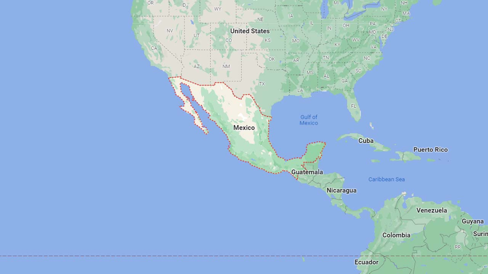

# Mexico

EN | FR | Spanish | Contry top-level domain | Driving side
--- | --- | --- | --- | ---
Mexico | Mexique | México  | .mx | Right

## Localisation
  
Le Mexique est situé au Sud de l'Amérique du Nord, entre les États-Unis au Nord et le Guatemala et Belize au Sud.

*source: [Google Maps](https://www.google.com/maps)*

## Drapeau

*source: [Wikipedia](https://en.wikipedia.org/wiki/Mexico)*

## Couverture

Le pays est assez bien couvert, même si la couverture est moins présente au Nord/Nord-Est.  

*source: [Geoguessr](https://www.geoguessr.com/)*

## Google car

La plupart du temps, on peu voir un capot arrière bleu flouté *(Gen 4 coverage)*. Une voiture blanche avec une attenne visible peu aussi apparaitre.  

*source: [Google](https://earth.google.com/web)*

## Plaques d'immatriculations

Les plaques mexicaines sont très difficiles à reconnaitre, chaque état à sa propre plaque et elles sont régulièrement changées. *source: [Wikipedia](https://en.wikipedia.org/wiki/Vehicle_registration_plates_of_Mexico)*   

*source: [Google](https://earth.google.com/web)*

## Routes et signalisation

### Routes

Les routes ont des lignes extérieures blanches et une ou deux lignes jaunes au centre.  

*source: [Google](https://earth.google.com/web)*
On peut aussi trouver des routes ressemblant à celle-ci.  

*source: [Google](https://earth.google.com/web)*

### Délimitateurs

Les délimitateurs mexicains sont blancs avec un bandeau noir sur la base ou au-dessus de la base de la borne.  

*source: [Google](https://earth.google.com/web)*
