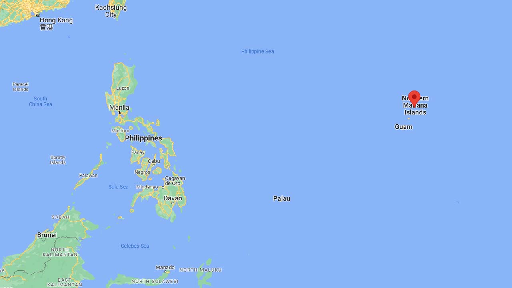
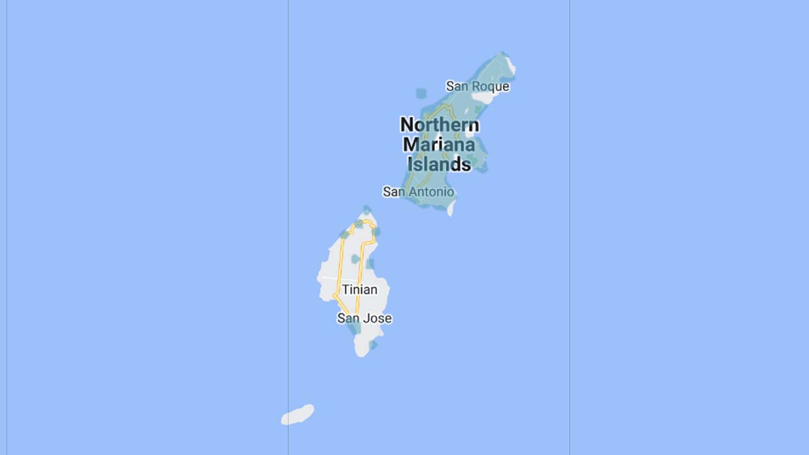

# Northern Mariana Islands

EN | FR | Chamorro | Contry top-level domain | Driving side
--- | --- | --- | --- | ---
Northern Mariana Islands | Îles Mariannes du Nord | Notte Mariånas  | mp | Right

## Localisation

Les Îles Mariannes du Nord sont situées dans l'océan Pacifique, à l'Est des Philippines.  

*[Google Maps](https://www.google.com/maps)*

## Drapeau

*[Wikipedia](https://en.wikipedia.org/wiki/Northern_Mariana_Islands)*

## Couverture

Les axes principaux de l'île là plus au Nord sont couverts, la couverture l'île au Sud de celle-ci est minime.

*[Geoguessr](https://www.geoguessr.com/)*
