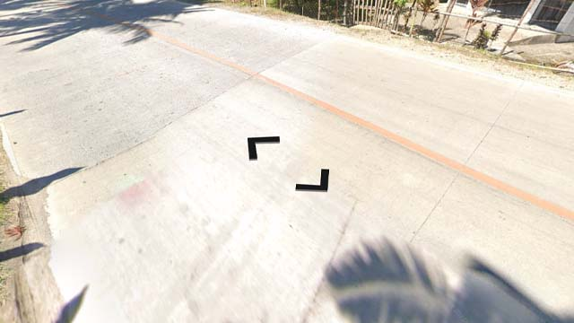

# Philippines

EN | FR | Filipino | Contry top-level domain | Driving side
--- | --- | --- | --- | ---
Philippines | Philippines | Pilipinas | .ph | Right

## Localisation

Les Philippines sont situées en Asie du Sud, à l'Ouest de l'océan Pacifique.

*[Google Maps](https://www.google.com/maps)*

## Drapeau

*[Wikipedia](https://en.wikipedia.org/wiki/Philippines)*

## Routes

Les routes sont souvent faites de gros blocs de béton.  

*source: [Google](https://earth.google.com/web)*
