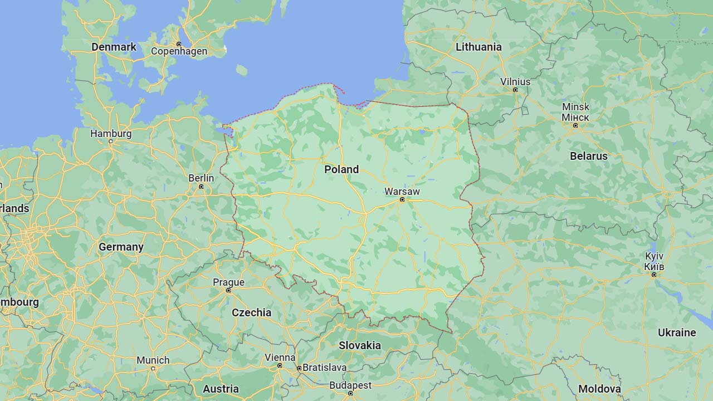
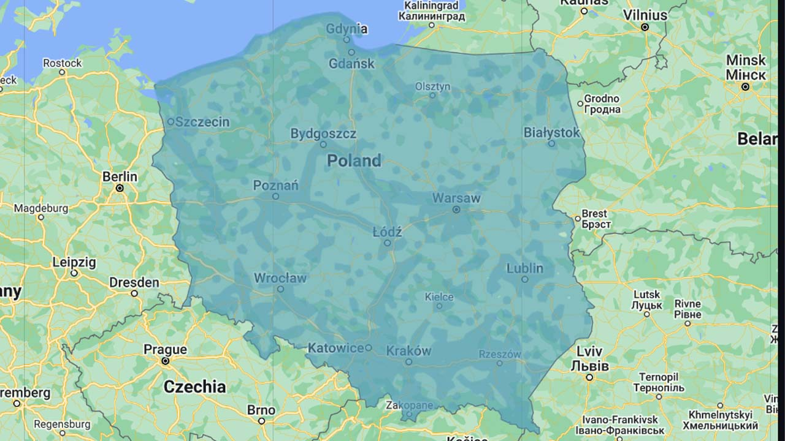
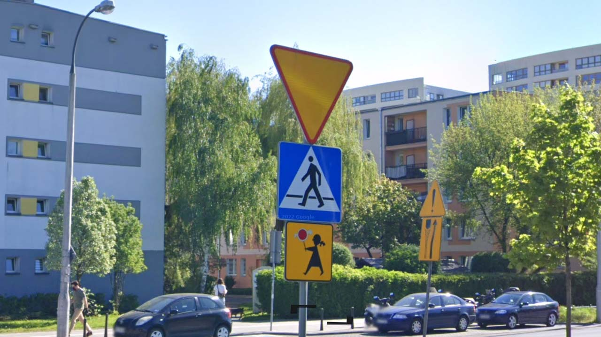
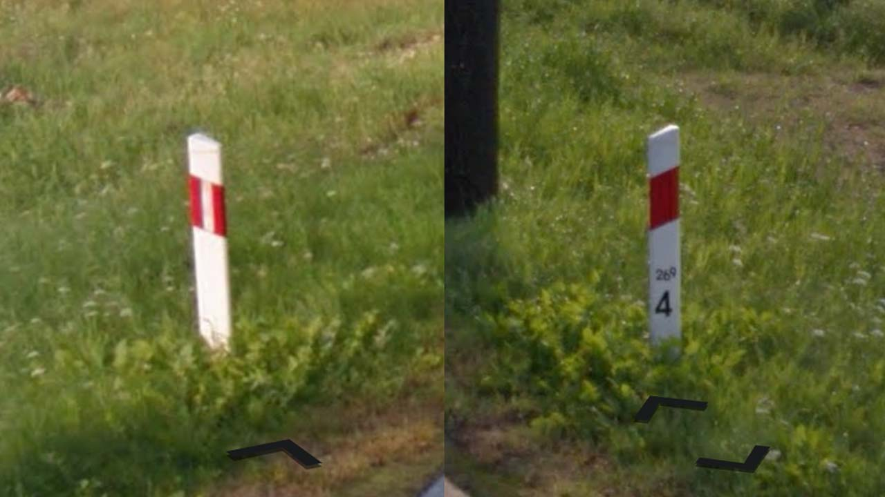

# Poland

EN | FR | Polish | Contry top-level domain | Driving side
--- | --- | --- | --- | ---
Poland | Pologne | Polska  | .pl | Right

## Localisation

La Pologne est situé en Europe centrale, entre l'Allemagne, la Tchéquie, la Slovaquie, l'Ukraine, la Biélorussie, la Lituanie et une exclave de la Russie.  

*[Google Maps](https://www.google.com/maps)*

## Drapeau

*[Wikipedia](https://en.wikipedia.org/wiki/Poland)*

## Couverture

La couverture est relativement complète.  

*[Geoguessr](https://www.geoguessr.com/)*

## Routes et signalisation

Les panneaux de vigilance de ce type, avec un contour rouge extrêmement fin sont uniques à la Pologne. Les panneaux bleu et blanc précédant des passages piétons sont aussi très fréquents.  

*[Google](https://earth.google.com/web)*

Les délimitateurs sont bancs avec une bande oblique rouge, le kilométrage est visible à l'avant tandis qu'une bande réfléchissante blanche horizontale se trouve à l'arrière.  

*[Google](https://earth.google.com/web)*
