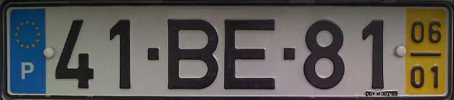
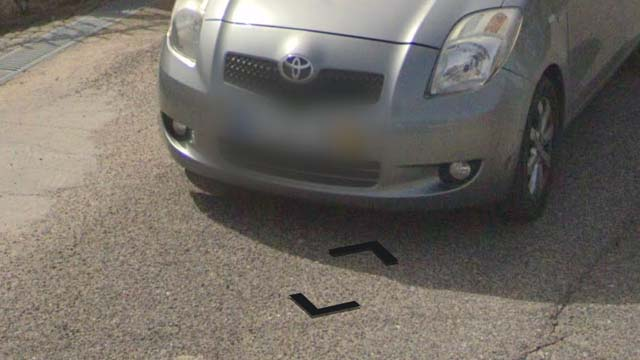

# Portugal

EN | FR | Portuguese | Contry top-level domain | Driving side
--- | --- | --- | --- | ---
Portugal | Portugal | Portugal | .pt | Right

## Plaques d'immatriculations

Présence d'une bande jaune sur le bord droit des plaques de 2000 à 2020, visible à travers le flou. Les plaques plus récentes ne l'ont pas.  

*source: [Google](https://earth.google.com/web)*

