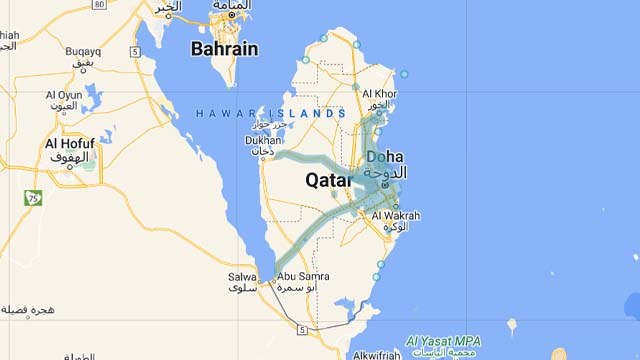
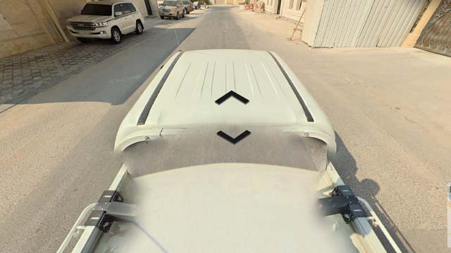
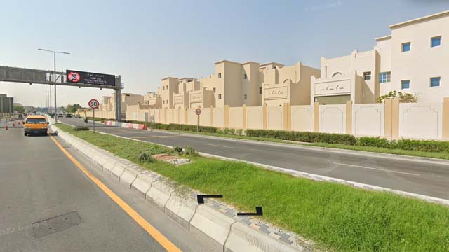
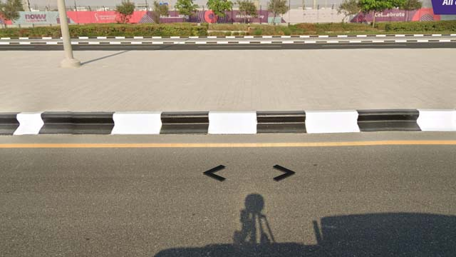
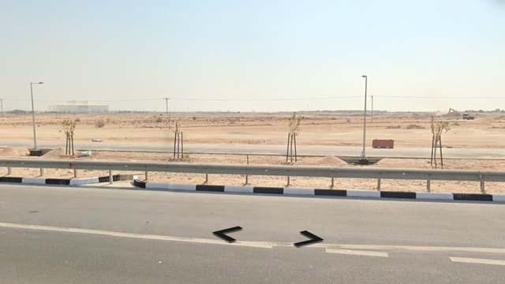

# Qatar

EN | FR | Arabic | Contry top-level domain | Driving side
--- | --- | --- | --- | ---
Qatar | Qatar | دولة قطر | .qa | Right

## Google car

La couverture est centrée autour de Doha et des infrastructures de la coupe du monde de footballs.  

*source: [Google](https://earth.google.com/web)*

La voiture est un pick up blanc similaire à celui du Sénégal mais avec une antenne sur le bord gauche.  

*source: [Google](https://earth.google.com/web)*

## Paysage

### Villes

Les bâtiments sont très reconnaissables et l'environnement est très plat et sableux.  

*source: [Google](https://earth.google.com/web)*

Les trottoirs sont souvent peints en noir et blanc.  

*source: [Google](https://earth.google.com/web)*

On peut aussi trouver certains arbres de ce type.  

*source: [Google](https://earth.google.com/web)*

### Campagnes

En dehors des villes l'environnement est plat et désertique.  

*source: [Google](https://earth.google.com/web)*
