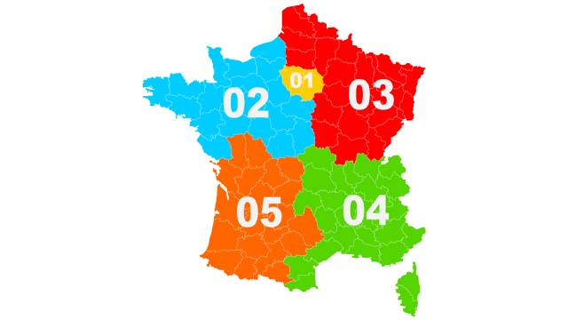
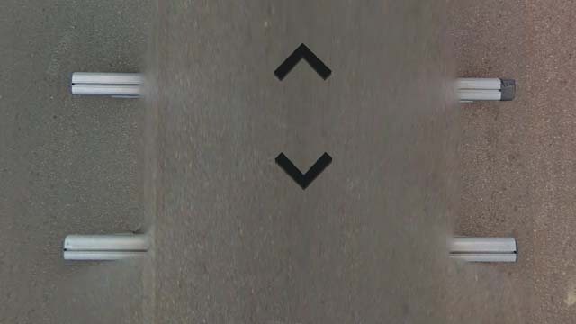
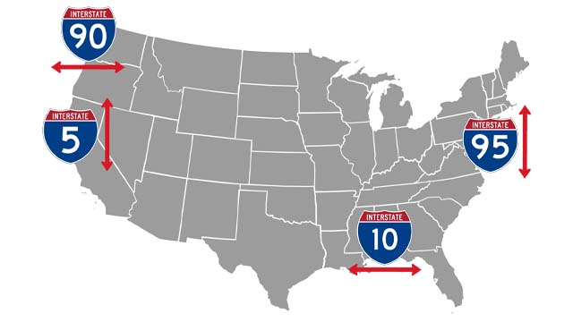

# Official coverage by country οr territory

Country οr territory (en) | Contry top-level domain 
--- | --- |
Åland | .ax |
Albania | .al |
American Samoa | .as |
Andorra | .ad |
Antarctica | .aq |
Argentina | .ar |
Australia | .au |
Austria | .at |
Bangladesh | .bd |
Belarus | .by |
Belgium | .be |
Bermuda | .bm |
Bhutan | .bt |
Bolivia | .bo |
Botswana | .bw |
Brazil | .br |
British Indian Ocean Territory | .io |
Bulgaria | .bg |
Cambodia | .kh |
Canada | .ca |
Chile | .cl |
China | .cn |
Christmas Island | .cx |
Cocos (Keeling) Islands | .cc |
Colombia | .co |
Costa Rica | .cr |
Croatia | .hr |
Curaçao | .cw |
Czech Republic | .cz |
Denmark | .dk |
Dominican Republic | .do |
Ecuador | .ec |
Egypt | .eg |
Estonia | .ee |
Eswatini (Swaziland) | .sz |
Falkland Islands | .fk |
Faroe Islands | .fo |
Finland | .fi |
[France](#france) | .fr |
Germany | .de |
[Ghana](#ghana) | .gh |
Gibraltar | .gi |
Greece | .gr |
Greenland | .gl |
Guatemala | .gt |
Hong Kong | .hk |
Hungary | .hu |
Iceland | .is |
India | .in |
Indonesia | .id |
Iraq | .iq |
Ireland | .ie |
Isle of Man | .im |
Israel | .il |
Italy | .it |
Japan | .jp |
Jersey | .je |
Jordan | .jo |
Kenya | .ke |
South Korea | .kr |
Kyrgyzstan | .kg |
Laos | .la |
Latvia | .lv |
Lebanon | .lb |
Lesotho | .ls |
Liechtenstein | .li |
Lithuania | .lt |
Luxembourg | .lu |
Mali* | .ml |
Macau | .mo |
Madagascar | .mg |
Malaysia | .my |
Malta | .mt |
Martinique | .mq |
Mexico | .mx |
Monaco | .mc |
Mongolia | .mn |
Montenegro | .me |
Nepal | .np |
Netherlands | .nl |
New Zealand | .nz |
Nigeria | .ng |
North Macedonia | .mk |
Northern Mariana Islands | .mp |
Norway | .no |
Pakistan | .pk |
Palestine | .ps |
Peru | .pe |
Philippines | .ph |
Pitcairn Islands | .pn |
Poland | .pl |
Portugal | .pt |
Puerto Rico | .pr |
Qatar | .qa |
Réunion | .re |
Romania | .ro |
Russia | .ru |
Rwanda | .rw |
Saint Pierre and Miquelon | .pm |
San Marino | .sm |
Senegal | .sn |
Serbia | .rs |
Singapore | .sg |
Slovakia | .sk |
Slovenia | .si |
South Africa | .za |
South Georgia and the South Sandwich Islands | .gs |
Spain | .es |
Sri Lanka | .lk |
Svalbard | *Unused* |
Sweden | .se |
Switzerland | .ch |
Taiwan | .tw |
Tanzania | .tz |
Thailand | .th |
Tunisia | .tn |
Turkey | .tr |
Uganda | .ug |
Ukraine | .ua |
United Arab Emirates | .ae |
United Kingdom | .uk |
[United States](#united-states) | .us |
United States Minor Outlying Islands | *Unused* |
United States Virgin Islands | .vi |
Uruguay | .uy |
Vanuatu | .vu |
Vietnam | .vn |

# Tips by country οr territory

## France

- Telephone numbers

## Ghana

- Google car

Always a black tape on one of the roof bars.  

## United States

- Roads

Primary Interstate Highway System :

Odd numbers run N–S with numbers increasing from W to E and numbers run E–W with numbers increasing from S to N.  

*source: [Wikipedia](https://en.wikipedia.org/wiki/Interstate_Highway_System)*
