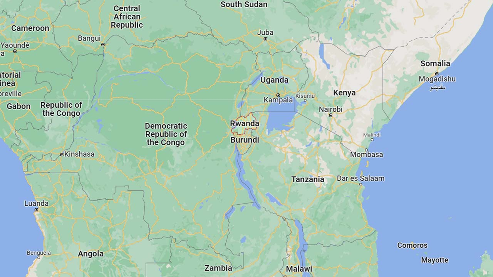
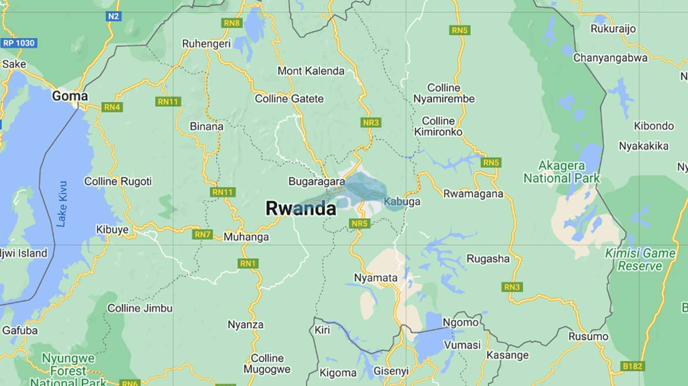
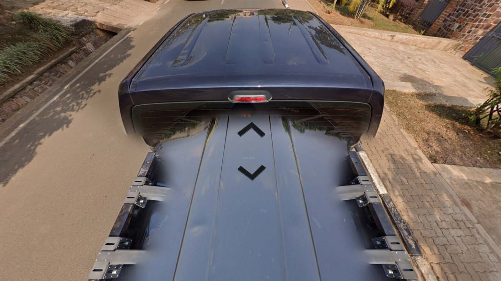
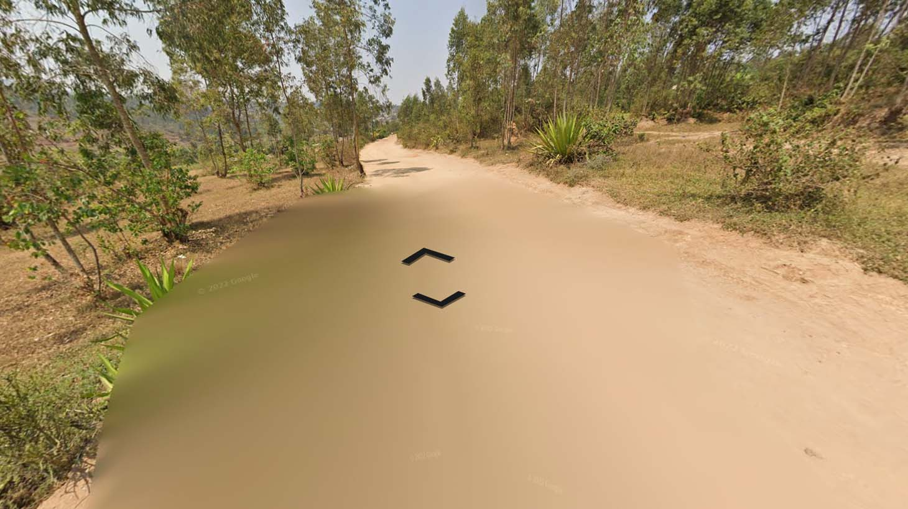

# Rwanda

EN | FR | Kinyarwanda | Contry top-level domain | Driving side
--- | --- | --- | --- | ---
Rwanda | Rwanda | Rwanda  | .rw | Right

## Localisation

Le Rwanda est situé en Afrique centrale, entre la République démocratique du Congo, l'Ouganda, le Kenya, la Tanzanie et le Burundi.  

*[Google Maps](https://www.google.com/maps)*

## Drapeau

*[Wikipedia](https://en.wikipedia.org/wiki/Rwanda)*

## Couverture
  
La couverture est très restreinte, seule la capitale "**Kigali**" est couverte.

*[Geoguessr](https://www.geoguessr.com/)*

## Google car

Un pick-up noir très reconnaissable est presque toujours visible. Il est flouté sur une toute petite partie, au Nord de la couverture, entre "**Gasharu**" et "**Kinyinya**".  

*[Google](https://earth.google.com/web)*
