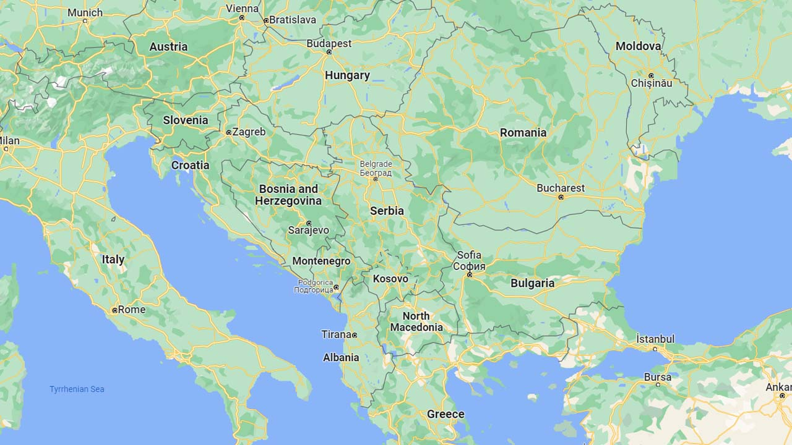
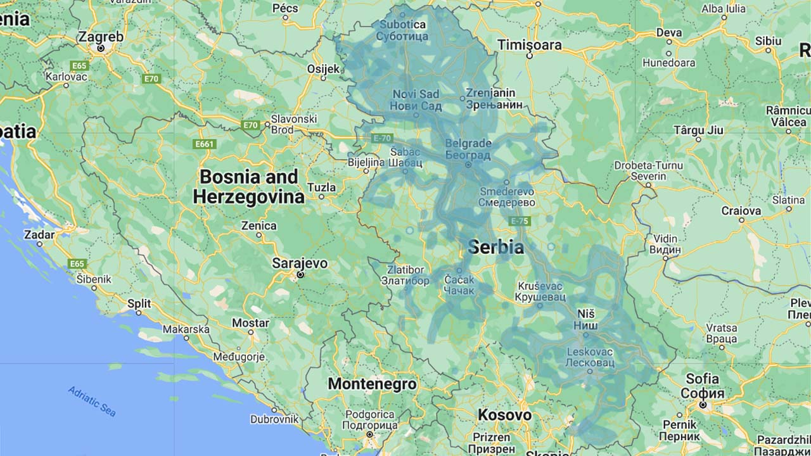
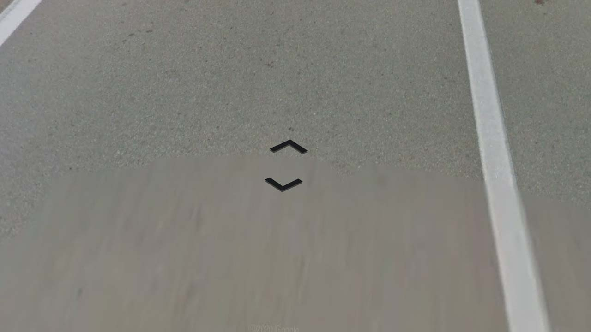
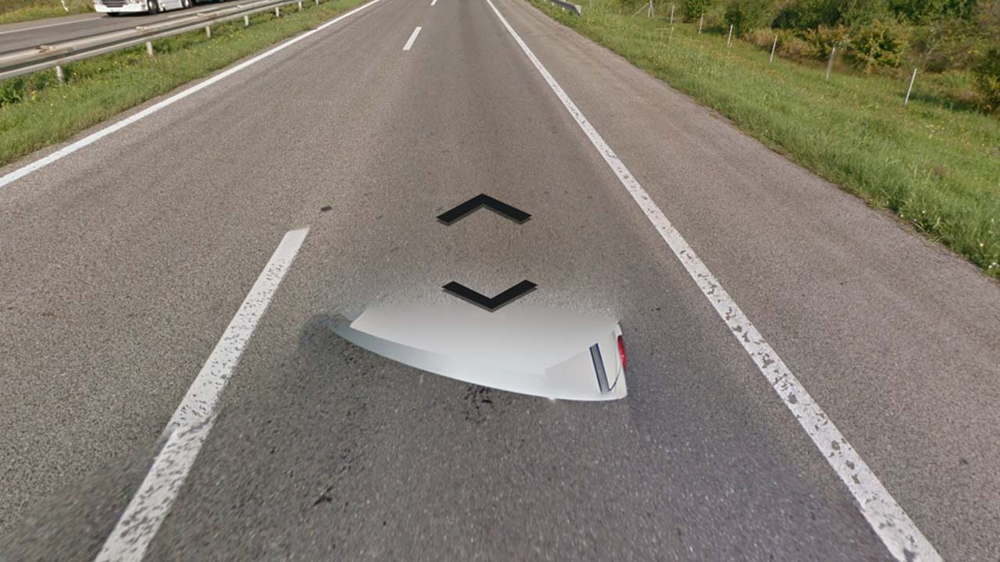
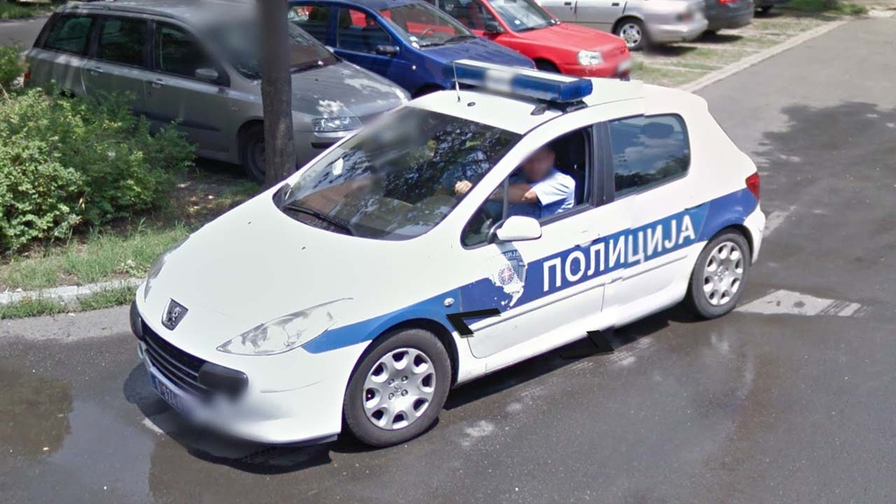
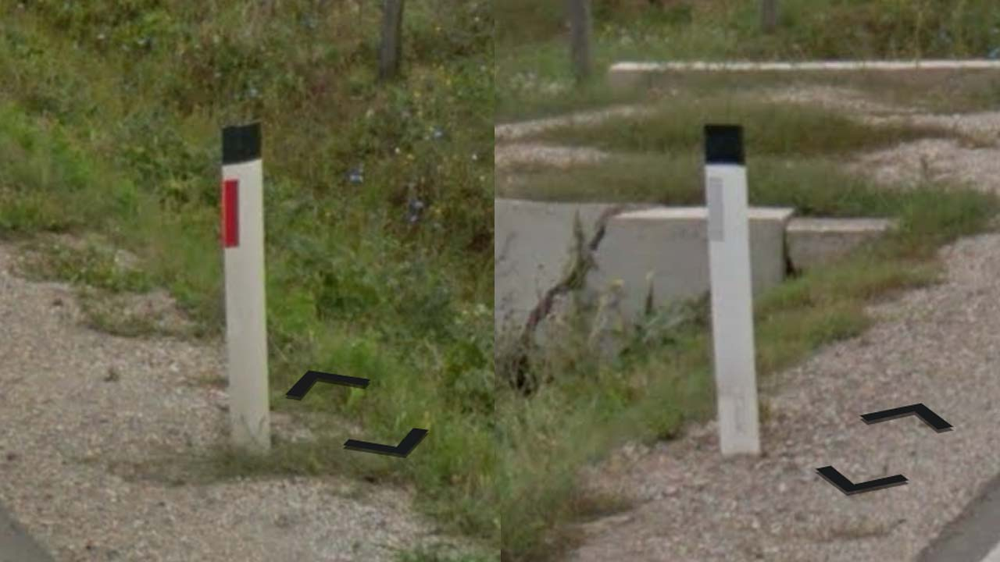
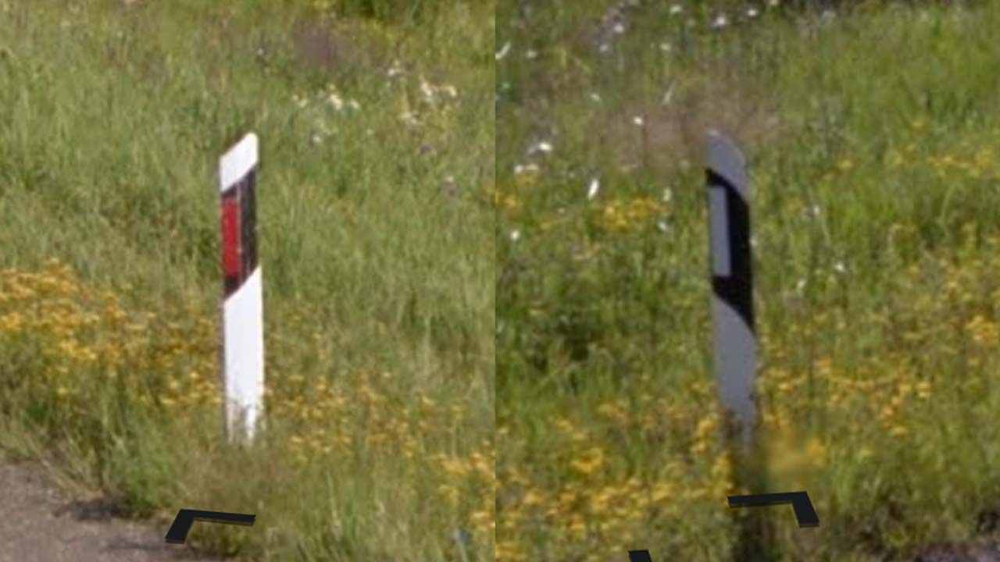

# Serbia

EN | FR | Serbian | Contry top-level domain | Driving side
--- | --- | --- | --- | ---
Serbia | Serbie | Србија / Srbija | .rs | Right

## Localisation

La Serbie est située au Sud-Est de l'Europe, entre le Monténégro, la Bosnie-Herzégovine, la Croatie, la Hongrie, la Roumanie, la Bulgarie, la Macédoine du Nord, et en fonction des positions d'indépendances, le Kosovo ou l'Albanie.  

*[Google Maps](https://www.google.com/maps)*

## Drapeau

*[Wikipedia](https://en.wikipedia.org/wiki/Serbia)*

## Couverture

La couverture est centrée sur les villes et villages ainsi que les principaux axes routiers.

*[Geoguessr](https://www.geoguessr.com/)*

## Google car

La plupart du temps, aucun élément n'est visible, néanmoins un arrière blanc où son antenne peut être visibles sur certaines grandes routes ou dans une petite partie de Belgrade. *[somerandomstuff1](https://somerandomstuff1.wordpress.com/2019/02/08/geoguessr-the-top-tips-tricks-and-techniques/#serbia)*  

*[Google](https://earth.google.com/web)*

## Plaques d'immatriculations

Les plaques serbes possèdent sont blanches avec une bande bleue européenne sur la gauche de la plaque. *[Wikipedia](https://en.wikipedia.org/wiki/Vehicle_registration_plates_of_Serbia)*     

*[Wikipedia](https://en.wikipedia.org/wiki/Vehicle_registration_plates_of_Serbia)*  

Les services de police et les pompiers ont des plaques différentes.  

*[Wikipedia](https://en.wikipedia.org/wiki/Vehicle_registration_plates_of_Serbia)*

*[Google](https://earth.google.com/web)*

## Routes et signalisation

### Délimitateurs

Deux types de délimitateurs peuvent être vus, ceux-ci sont les plus courants. Les bandes réfléchissantes peuvent aussi être centrées verticalement.    

*[Google](https://earth.google.com/web)*

Cette forme est plus rare et visible sur certaines grandes routes et ressemble plus aux bornes des pays alentour.  

*[Google](https://earth.google.com/web)*
