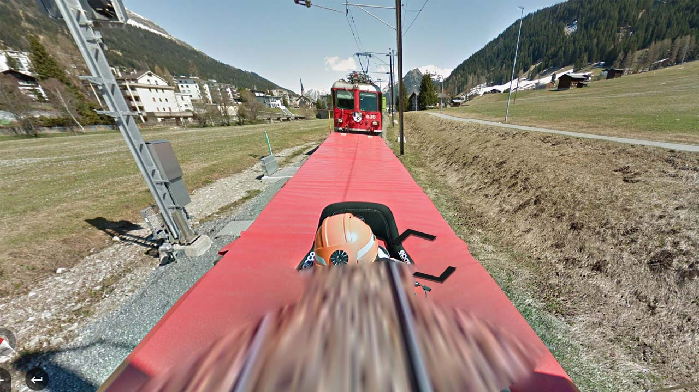
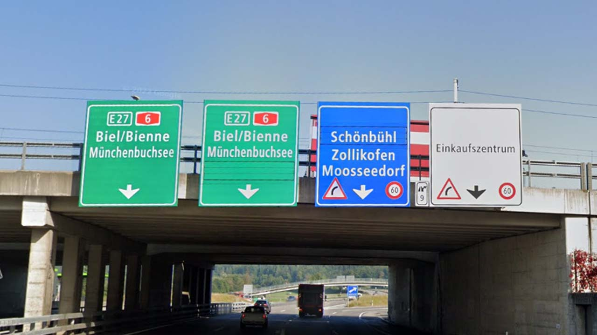
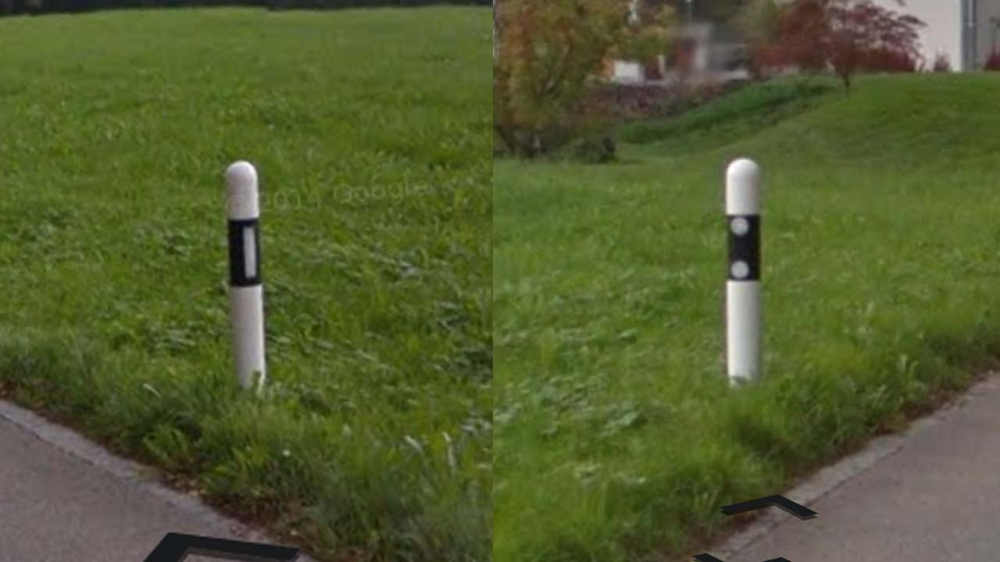
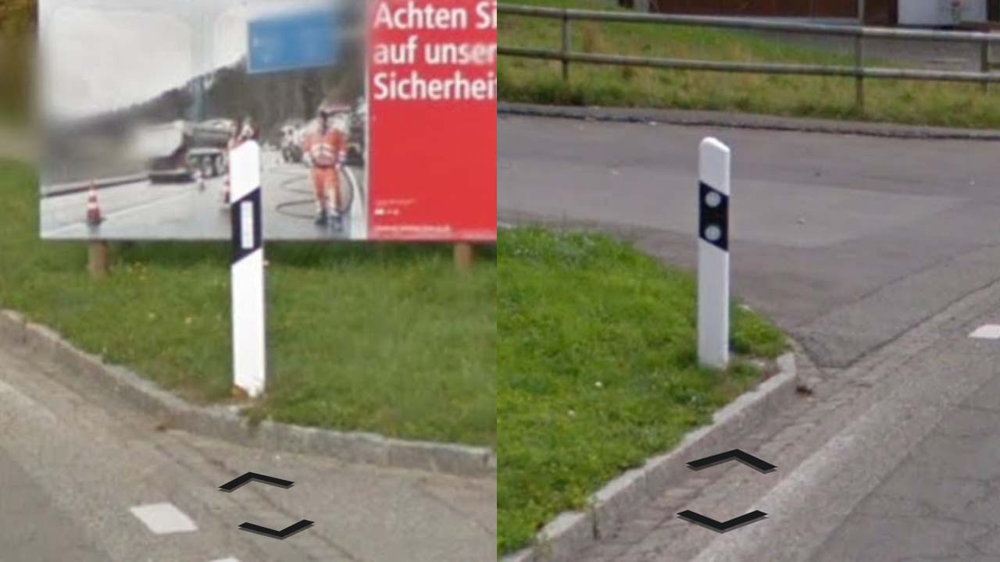

# Switzerland

EN | FR | Deutsch | Contry top-level domain | Driving side
--- | --- | --- | --- | ---
Switzerland | Suisse | Schweiz | .ch | Right

## Localisation

La Suisse est un pays d'Europe centrale située entre la France, l'Allemagne, l'Autriche, le Liechtenstein, et l'Italie.

*source: [Google Maps](https://www.google.com/maps)*

## Drapeau

*source: [Wikipédia](https://en.wikipedia.org/wiki/Switzerland)*

## Couverture

La couverture est très complète.  

*source: [Geoguessr](https://www.geoguessr.com/)*

Il existe une couverture ferroviaire, très reconnaissable (situé au Sud-Est du pays).

*source: [Geoguessr](https://www.geoguessr.com/)*

## Langue

Le pays utilise en majorité l'allemand, mais aussi le français à l'ouest, l'italien au sud et dans une moindre mesure, à l'est, le romanche. *source: [Wikipédia](https://en.wikipedia.org/wiki/Switzerland#Languages)*  

*source: [Wikipédia](https://en.wikipedia.org/wiki/Switzerland#Languages)*

## Plaques d'immatriculations

Contrairement à la plupart des pays d'Europe, les plaques suisses sont blanches et n'ont pas de bandes bleues, elles sont aussi un peu moins allongées. *source: [Wikipedia](https://en.wikipedia.org/wiki/Vehicle_registration_plates_of_Switzerland)*  

*source: [Wikipédia](https://en.wikipedia.org/wiki/Switzerland)*  
Les plaques peuvent apparaître dans plusieurs formats.

*source: [Google](https://earth.google.com/web)*

## Routes et signalisations

Les autoroutes (*autobahnen* en allemand) sont signalés par des numéros dans hexagones rouges étirés. Les numéros des "routes principales" (*Hauptstraßen*) sont indiqués dans des carrés bleues. *source: [Wikipédia](https://en.wikipedia.org/wiki/Motorways_of_Switzerland)*
*source: [Wikipédia](https://en.wikipedia.org/wiki/Motorways_of_Switzerland)*  
Le numéros européens apparaissent dans des carrés vert.  

*source: [Google](https://earth.google.com/web)*

Les passages piétons sont jaunes.  

*source: [Google](https://earth.google.com/web)*

Des signalisations noir et blanches ou noir et jaunes apparaissent très souvent.  

*source: [Google](https://earth.google.com/web)*

En campagne, des bornes sont visibles le long des routes, elle peuvent avoir un bout rond ou triangulaire.   

*source: [Google](https://earth.google.com/web)*
