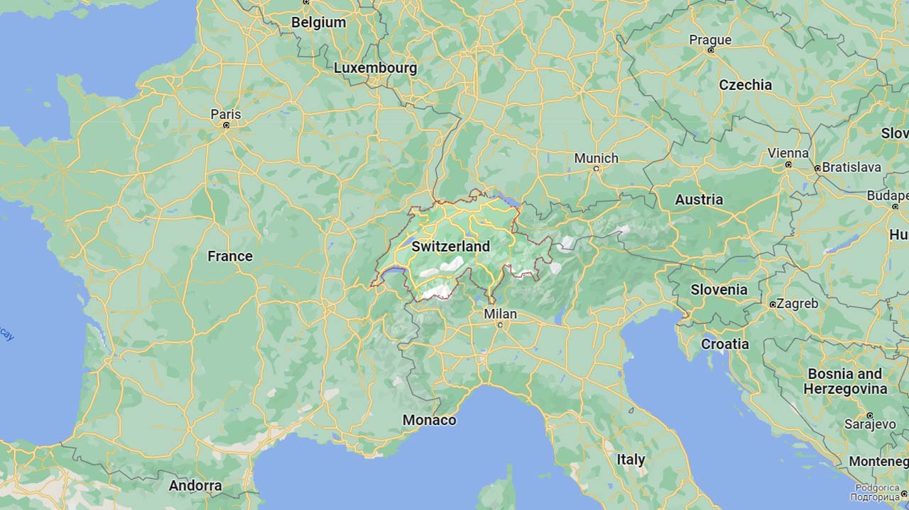
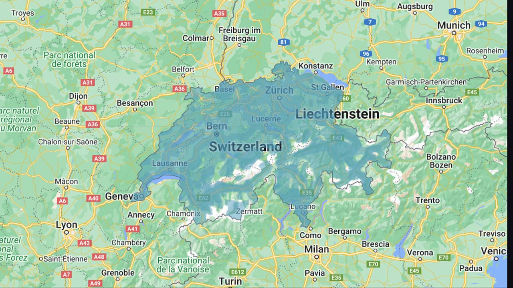
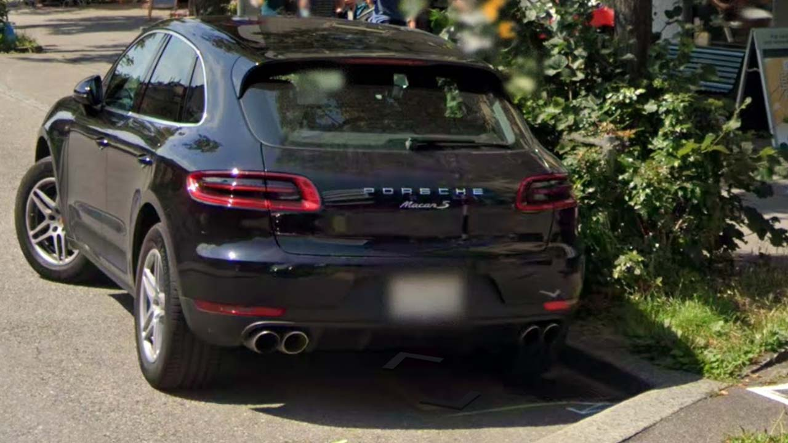
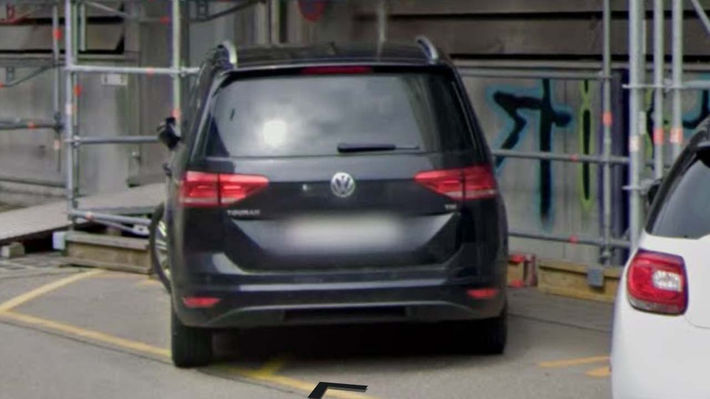
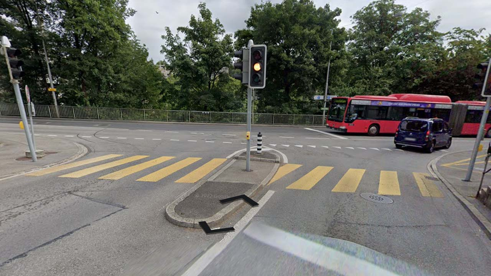
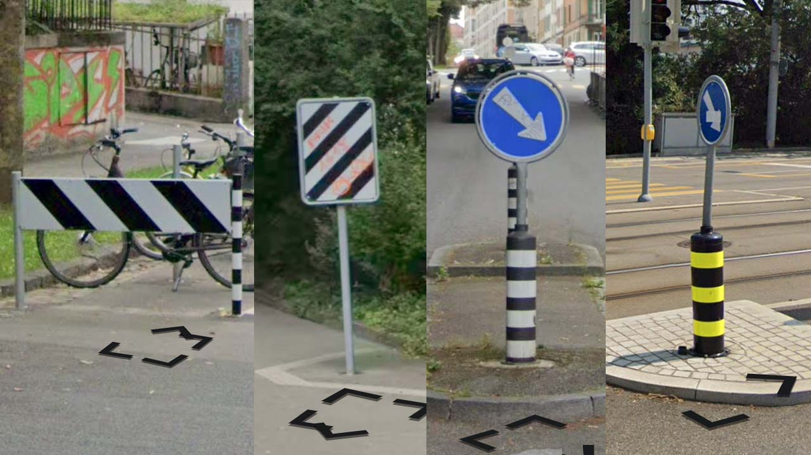

# Switzerland

EN | FR | Deutsch | Contry top-level domain | Driving side
--- | --- | --- | --- | ---
Switzerland | Suisse | Schweiz | .ch | Right

## Localisation

La Suisse est un pays d'Europe centrale située entre la France, l'Allemagne, l'Autriche, le Liechtenstein, et l'Italie.

*source: [Google Maps](https://www.google.com/maps)*

## Drapeau

*source: [Wikipédia](https://en.wikipedia.org/wiki/Switzerland)*

## Couverture

La couverture est très complète.  

*source: [Geoguessr](https://www.geoguessr.com/)*

## Plaques d'immatriculations

Contrairement à la plupart des pays d'Europe, les plaques suisses sont blanches et n'ont pas de bandes bleues, elles sont aussi un peu moins allongées. *source: [Wikipedia](https://en.wikipedia.org/wiki/Vehicle_registration_plates_of_Switzerland)*  

*source: [Wikipédia](https://en.wikipedia.org/wiki/Switzerland)*  
Les plaques peuvent apparaître dans plusieurs formats.

*source: [Google](https://earth.google.com/web)*

## Routes et signalisations

Les passages piétons sont jaunes.  

*source: [Google](https://earth.google.com/web)*

Des signalisations noir et blanches ou noir et jaunes apparaissent très souvent.  

*source: [Google](https://earth.google.com/web)*
