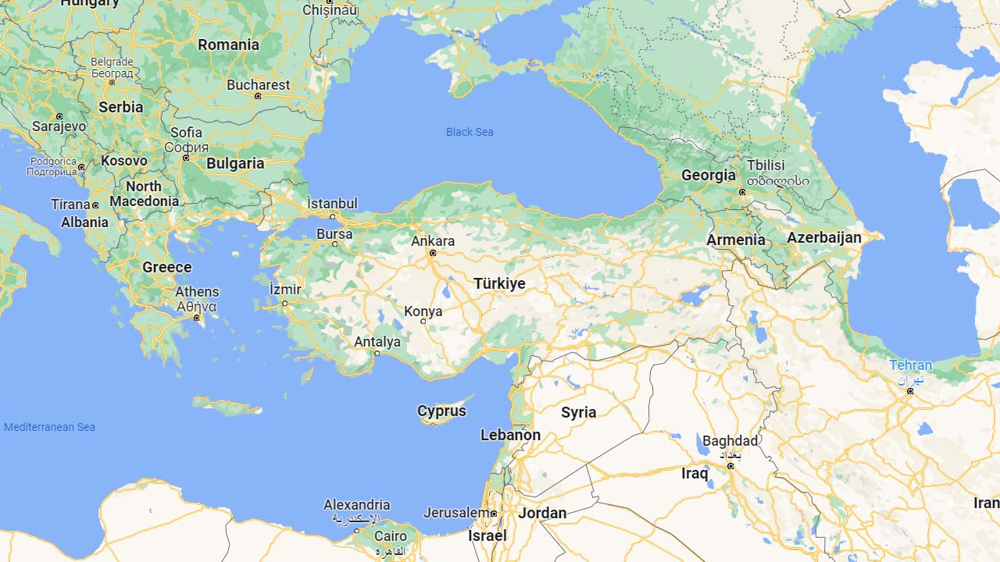
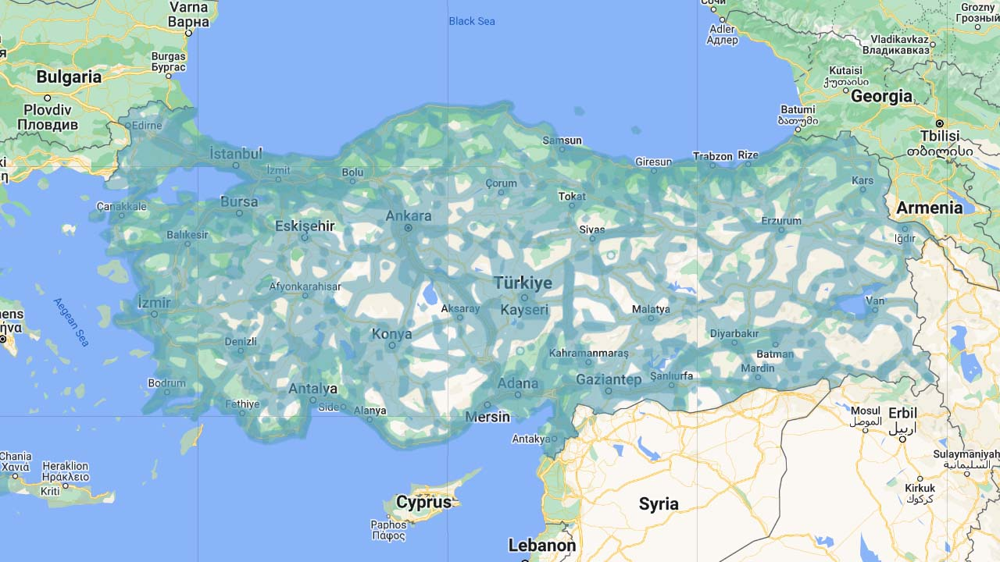

# Turkey

EN | FR | Turkish | Contry top-level domain | Driving side
--- | --- | --- | --- | ---
Turkey | Turquie | Türkiye  | .tr | Right

## Localisation

La Turquie est un pays transcontinental situé entre l'Europe et l'Asie. Il partage ses frontières avec la Bulgarie et la Grèce à l'Ouest, la Géorgie, l'Arménie et l'Azerbaïdjan au Nord-Est, et l'Iran, l'Irak et la Syrie au Sud-Est.  

*[Google Maps](https://www.google.com/maps)*

## Drapeau

*[Wikipedia](https://en.wikipedia.org/wiki/Turkey)*

## Couverture

La couverture est assez complète et quadrille les zones plus naturelles du pays par les routes principales.  

*[Geoguessr](https://www.geoguessr.com/)*

## Langue

La langue officielle est le Turc, elle peut être reconnue par la présence des lettres "**ö**", "**ı**", "**ğ**" et surtout "**ş**" qui est très courante. *[Wikipedia](https://en.wikipedia.org/wiki/Turkish_language), [somerandomstuff1](https://somerandomstuff1.wordpress.com/2019/02/08/geoguessr-the-top-tips-tricks-and-techniques/)*  

*[Google](https://earth.google.com/web)*
