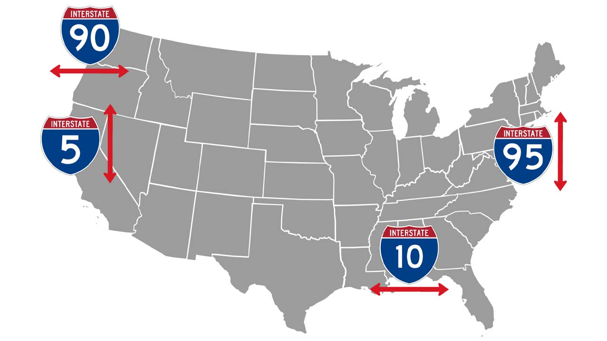

# United States

## Roads

Primary Interstate Highway System :

Odd numbers run N–S with numbers increasing from W to E and numbers run E–W with numbers increasing from S to N.  

*source: [Wikipedia](https://en.wikipedia.org/wiki/Interstate_Highway_System)*
