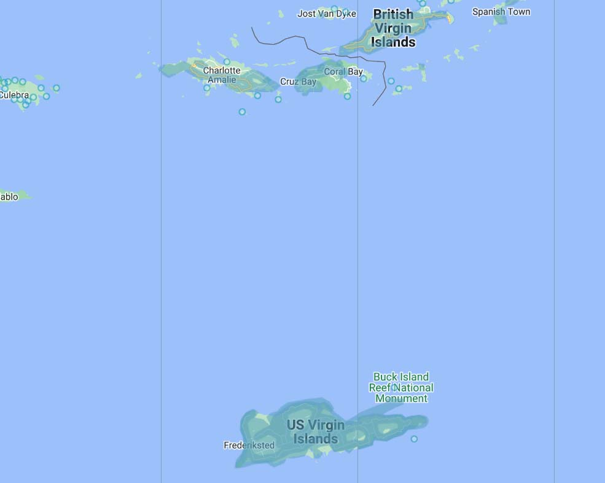
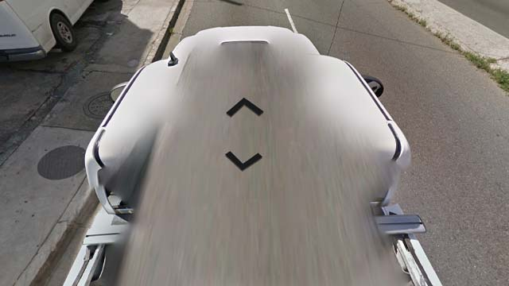
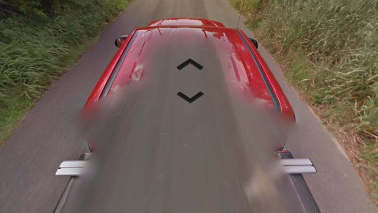
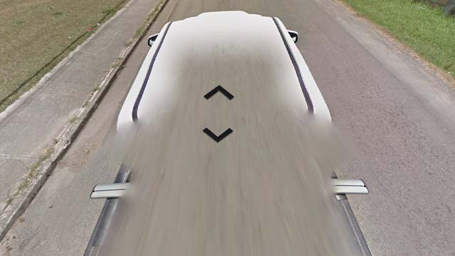

# United States Virgin Islands

EN | FR | English | Contry top-level domain | Driving side
--- | --- | --- | --- | ---
United States Virgin Islands | Îles Vierges des États-Unis | United States Virgin Islands | .vi | Left

# Drapeau

*source: [Wikipédia](https://en.wikipedia.org/wiki/United_States_Virgin_Islands)*

## Google car

L'archipel appartenant aux États-Unis contient deux îles au Nord, à côté de la partie britannique, et une plus grande ile plus au Sud.  

*source: [Geoguessr](https://www.geoguessr.com/)*

Les îles du Nord sont couvertes par un pick-up blanc très reconnaissable.  

*source: [Google](https://earth.google.com/web)*

L'Île du Sud est couverte par un pick-up rouge avec une antenne à droite. Il peut aussi arriver de tomber sur un pick-up blanc sur cette île.  

*source: [Google](https://earth.google.com/web)*
